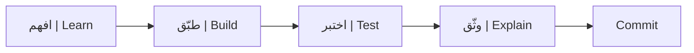

# دليل البرنامج | Course Guide

**معالجة اللغات الطبيعية التطبيقية · Applied Natural Language Processing**  
**إعداد وتقديم:** ميعاد المري · **Instructor:** Meaad Al-Marri

## لمن صُمم البرنامج؟ | Audience

هذا برنامج **Specialist** حتى 20 مشاركًا من مهندسي الذكاء الاصطناعي والمهتمين بالتطبيقات اللغوية. المتطلب الرسمي السابق هو `SDA-AIE-112` أو أساس مكافئ في Python وتعلم الآلة. يبدأ الجميع بالمسار 🟢 Core؛ وتوفر السقالات والأمثلة المصغرة دعمًا لاختلاف الثقة العملية دون خفض المستوى أو إسقاط المتطلب السابق. ينتقل المنتهي مبكرًا إلى 🔵 Explore أو 🟣 Distinction.

## أهداف البرنامج | Learning outcomes

بنهاية الأيام الأربعة ستتمكن من:

1. بناء preprocessing وtokenisation للنص العربي والإنجليزي.
2. تفسير self-attention وبنية Transformer encoder.
3. تكييف نموذج مدرب مسبقًا للتصنيف وNER وextractive QA.
4. بناء semantic search باستخدام sentence embeddings.
5. اختيار metrics صحيحة وإجراء error analysis.
6. مقارنة inference baseline وoptimized من حيث السرعة والذاكرة والجودة.
7. تسليم مشروع بيان ثنائي اللغة في مستودع GitHub عام.

راجع [مصفوفة الهدف والتطبيق والدليل](docs/01-outcomes-map.md).

## طريقة التعلم | How learning works

كل موضوع يمر بخمس حركات:

1. **لماذا؟** مشكلة حقيقية صغيرة.
2. **ما هو؟** تعريف ومثال.
3. **شاهد.** عرض عملي قصير.
4. **طبّق.** TODO واختبار فوري.
5. **اثبت.** ملف أو metric أو commit يمكن مراجعته.

لا تحصل على نقاط لمجرد تشغيل خلية؛ المطلوب أن تفسر النتيجة والقرار.

## رحلة التعلم | Learning journey

أربعة أيام متدرجة، ولكل يوم مفاهيم وتطبيق ودليل. [افتح رحلة الأيام دون جدول زمني تفصيلي](docs/04-delivery-plan.md).

Four progressive days, each with concepts, practice and evidence. Open the journey guide for topic summaries.

## محتوى الأيام | Day-by-day

### [اليوم 1 — من النص إلى Tensor](day-01/README.md)

- Unicode والنص العربي/الإنجليزي.
- التنظيف، PII masking، والتطبيع كقرار.
- الكلمات، subwords، special tokens، وfertility.
- التضمينات والسياق.
- attention وTransformer encoder.
- [دفتر معالجة النصوص والترميز](notebooks/01_text_processing_tokenization.ipynb).
- [دفتر الانتباه والمحولات](notebooks/02_attention_transformers.ipynb).
- [مختبرات اليوم الأول وبوابة Gate A](day-01/04-labs-checkpoint.md).
- **مخرج بيان:** preprocessing module واختيار tokenizer مدعوم بقياس.

### [اليوم 2 — جعل النموذج متخصصًا](day-02/README.md)

- baseline قبل Transformer.
- classification وmacro-F1.
- NER وBIO labels ومحاذاة subwords.
- extractive QA وno-answer.
- مقدمة للنماذج العربية ومتعددة اللغات.
- [دفتر التصنيف والضبط الدقيق](notebooks/03_text_classification.ipynb).
- [دفتر NER وQA](notebooks/04_ner_and_qa.ipynb).
- [مختبرات اليوم الثاني وبوابة Gate B](day-02/05-labs-checkpoint.md).
- **مخرج بيان:** مسارات classification وNER وQA قابلة للتقييم.

### [اليوم 3 — العربية، البحث، والحقيقة](day-03/README.md)

- تحديات MSA واللهجات وclitics.
- CAMeL Tools واستخدامه المناسب.
- sentence embeddings وcosine similarity.
- FAISS وretrieve ثم re-rank.
- task metrics وslices وerror taxonomy.
- [دفتر معالجة العربية](notebooks/05_arabic_nlp.ipynb).
- [دفتر البحث الدلالي](notebooks/06_semantic_search.ipynb).
- [دفتر التقييم وتحليل الأخطاء](notebooks/07_evaluation_error_analysis.ipynb).
- [مختبرات اليوم الثالث وبوابة Gate C](day-03/04-labs-checkpoint.md).
- **مخرج بيان:** بحث ثنائي اللغة وتقرير تقييم وتحليل أخطاء.

### [اليوم 4 — أسرع، أخف، وقابل للتسليم](day-04/README.md)

- قياس latency وthroughput وmemory.
- length، padding، batching، ONNX وINT8.
- quality tax قبل قرار النشر.
- FastAPI واختبار الخدمة داخل Colab.
- تجميع بيان، التحقق، والعرض.
- [دفتر التحسين والخدمة](notebooks/08_optimization_serving.ipynb).
- [Benchmark وONNX وINT8](day-04/02-onnx-int8-decision.md).
- [الخدمة وcanaries](day-04/03-fastapi-serving-canaries.md).
- [بوابتا Gate D وGate E](day-04/05-lab-gates-submission.md).
- **مخرج بيان:** مستودع نهائي وAPI مختبرة وbenchmark موثق.

## التقييم | Assessment

**70 تقنية + 20 إدارية + 10 للعرض = 100 درجة إجمالًا.** العرض داخل المئة. تُقيّم نسخة التسليم مرة واحدة ولا تقبل نسخة معدلة بعد الإرسال. تبقى الأنشطة والاختبارات القصيرة للممارسة دون وزن مستقل.

**70 technical + 20 administrative + 10 presentation = 100 total.** The presentation is included. The submitted version is graded once; later replacements are not accepted. Practice activities and quizzes have no separate weight.

[سلم التقييم الكامل | Full rubric](docs/policies/assessment-and-completion.md) · [متطلبات العرض | Presentation](docs/presentation-guide.md)

## شروط الاجتياز | Completion requirements

الحد الأدنى **70/100** مع الأدلة الإلزامية والتسليم الصحيح وعدم ثبوت مخالفة نزاهة أو خصوصية. التميز من **90/100** بعد استيفاء الشروط، بلا نقاط خارج المئة. `submission-v1.0` وSHA النهائي يحددان النسخة التي ستصحح مرة واحدة.

A minimum of **70/100**, mandatory evidence, valid hand-in and no established integrity/privacy violation are required. Distinction starts at **90/100** after those conditions; no extra bonus is added. The final tag and recorded SHA identify the single assessed version.

إصدار الشهادة والحضور والتيسيرات الإدارية تخضع لإجراءات الجهة المنظمة. لا يُقدّم تعديل السلم باعتباره اعتمادًا جديدًا.

## سير العمل اليومي | Daily workflow

بعد كل مختبر:

1. شغّل الاختبارات.
2. احفظ notebook في Drive.
3. احفظ النسخة المطلوبة في GitHub.
4. حدّث `PROGRESS.md`.
5. استخدم commit message المحددة.
6. تأكد أن الصفحة العامة لا تحتوي أسرارًا أو بيانات شخصية.

## مشروع بيان | Bayan

بيان مشروع تعليمي لتحليل ملاحظات مستفيدين اصطناعية بالعربية والإنجليزية. سيبنى تدريجيًا؛ لذلك لا تنتظر اليوم الرابع لتبدأ. اقرأ [مواصفات المشروع](docs/03-capstone-spec.md) قبل اليوم الأول.

## ما تحتاجه وما لا تحتاجه | Requirements

**تحتاج:** جهاز محمول، متصفح حديث، حساب Google، حساب GitHub مؤكد، اتصال إنترنت، واستعداد للشرح والتجربة.

**لا تحتاج:** جهاز GPU، تثبيت Python محليًا، Colab Pro، API مدفوعة، أو خبرة سابقة في تدريب المحولات.

**تحتاج معرفيًا:** `SDA-AIE-112` أو ما يعادله: قراءة Python الأساسية، فهم tensors وtrain/validation/test، وفكرة عامة عن التصنيف والمقاييس.

## طريقة استخدام صفحات الدورة أثناء الشرح

- افتح الصفحة التي تعرضها المدربة.
- استخدم جدول المحتويات والعناوين للعودة إلى موضعك.
- افتح الروابط في تبويب جديد.
- لا تبدأ Explore أو Distinction قبل ظهور نجاح Core.
- عند العودة من الاستراحة راجع آخر مربع “تحقق”.
- في نهاية اليوم أغلق جميع runtimes غير المستخدمة بعد حفظ تقدمك.
