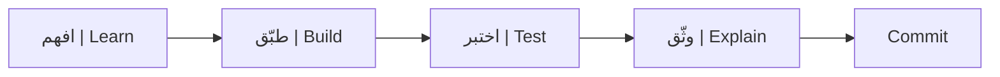

# دليل البرنامج | Course Guide

**معالجة اللغات الطبيعية التطبيقية · Applied Natural Language Processing**  
**إعداد وتقديم:** ميعاد المري · **Instructor:** Meaad Al-Marri

## لمن صُمم البرنامج؟ | Audience

صُمم لمجموعة مختلطة حتى 20 متدربًا:

- **مبتدئ:** يستطيع استخدام المتصفح ولا يُشترط أن يعرف NLP.
- **متوسط:** تعامل مع Python أو تعلم الآلة ويريد تطبيق Transformers.
- **مختص:** يريد قرارات أعمق في العربية والتقييم والأداء.

يبدأ الجميع بالمسار 🟢 Core؛ ثم يختار المنتهي مبكرًا 🔵 Explore أو 🟣 Distinction.

## أهداف البرنامج | Learning outcomes

بنهاية الأيام الأربعة ستتمكن من:

1. بناء preprocessing وtokenisation للنص العربي والإنجليزي.
2. تفسير self-attention وبنية Transformer encoder.
3. تكييف نموذج مدرب مسبقًا للتصنيف وNER وextractive QA.
4. بناء semantic search باستخدام sentence embeddings.
5. اختيار metrics صحيحة وإجراء error analysis.
6. مقارنة inference baseline وoptimized من حيث السرعة والذاكرة والجودة.
7. تسليم مشروع بيان ثنائي اللغة في مستودع GitHub عام.

راجع [مصفوفة الهدف والتطبيق والدليل](docs/01-outcomes-map.md).

## طريقة التعلم | How learning works

كل موضوع يمر بخمس حركات:

1. **لماذا؟** مشكلة حقيقية صغيرة.
2. **ما هو؟** تعريف ومثال.
3. **شاهد.** عرض عملي قصير.
4. **طبّق.** TODO واختبار فوري.
5. **اثبت.** ملف أو metric أو commit يمكن مراجعته.

لا تحصل على نقاط لمجرد تشغيل خلية؛ المطلوب أن تفسر النتيجة والقرار.

## جدول اليوم | Daily rhythm

| الوقت | النشاط |
|---|---|
| 08:30–09:20 | مفهوم وعرض عملي |
| 09:20–09:30 | استراحة |
| 09:30–10:20 | ممارسة موجهة |
| 10:20–10:30 | استراحة |
| 10:30–11:20 | مختبر |
| 11:20–11:30 | استراحة |
| 11:30–12:20 | مختبر/مشروع |
| 12:20–12:40 | استراحة طويلة/صلاة |
| 12:40–13:30 | بوابة إنجاز وحفظ التقدم |

إجمالي اليوم: 250 دقيقة تعلم و50 دقيقة استراحات.

## محتوى الأيام | Day-by-day

### [اليوم 1 — من النص إلى Tensor](day-01/README.md)

- Unicode والنص العربي/الإنجليزي.
- التنظيف، PII masking، والتطبيع كقرار.
- الكلمات، subwords، special tokens، وfertility.
- التضمينات والسياق.
- attention وTransformer encoder.
- [دفتر معالجة النصوص والترميز](notebooks/01_text_processing_tokenization.ipynb).
- [دفتر الانتباه والمحولات](notebooks/02_attention_transformers.ipynb).
- [مختبرات اليوم الأول وبوابة Gate A](day-01/04-labs-checkpoint.md).
- **مخرج بيان:** preprocessing module واختيار tokenizer مدعوم بقياس.

### [اليوم 2 — جعل النموذج متخصصًا](day-02/README.md)

- baseline قبل Transformer.
- classification وmacro-F1.
- NER وBIO labels ومحاذاة subwords.
- extractive QA وno-answer.
- مقدمة للنماذج العربية ومتعددة اللغات.
- [دفتر التصنيف والضبط الدقيق](notebooks/03_text_classification.ipynb).
- [دفتر NER وQA](notebooks/04_ner_and_qa.ipynb).
- [مختبرات اليوم الثاني وبوابة Gate B](day-02/05-labs-checkpoint.md).
- **مخرج بيان:** مسارات classification وNER وQA قابلة للتقييم.

### [اليوم 3 — العربية، البحث، والحقيقة](day-03/README.md)

- تحديات MSA واللهجات وclitics.
- CAMeL Tools واستخدامه المناسب.
- sentence embeddings وcosine similarity.
- FAISS وretrieve ثم re-rank.
- task metrics وslices وerror taxonomy.
- [دفتر معالجة العربية](notebooks/05_arabic_nlp.ipynb).
- [دفتر البحث الدلالي](notebooks/06_semantic_search.ipynb).
- [دفتر التقييم وتحليل الأخطاء](notebooks/07_evaluation_error_analysis.ipynb).
- [مختبرات اليوم الثالث وبوابة Gate C](day-03/04-labs-checkpoint.md).
- **مخرج بيان:** بحث ثنائي اللغة وتقرير تقييم وتحليل أخطاء.

### اليوم 4 — أسرع، أخف، وقابل للتسليم

- قياس latency وthroughput وmemory.
- length، padding، batching، ONNX وINT8.
- quality tax قبل قرار النشر.
- FastAPI واختبار الخدمة داخل Colab.
- تجميع بيان، التحقق، والعرض.
- **مخرج بيان:** مستودع نهائي وAPI مختبرة وbenchmark موثق.

## التقييم | Assessment

| المكوّن | الوزن | ماذا يثبت؟ |
|---|---:|---|
| المختبرات 1–7 | 35% | التطبيق اليومي والاختبارات والـcommits |
| تقييمان عمليان | 15% | التشخيص والمراجعة بالدليل |
| اختبار قصير | 10% | فهم المفاهيم والقرارات |
| مشروع بيان | 40% | التكامل والتقييم والتوثيق والعرض |

التفاصيل في [التقييم والاجتياز](docs/policies/assessment-and-completion.md).

## شروط الاجتياز المختصرة | Completion summary

- 70/100 فأعلى إجمالًا.
- 70/100 فأعلى في مشروع بيان.
- حضور 80% على الأقل، أو سياسة الأكاديمية الأشد.
- مستودع GitHub عام مكتمل.
- اجتياز فاحص التسليم.
- tag نهائي `submission-v1.0`.
- لا مخالفة نزاهة أو خصوصية.

## سير العمل اليومي | Daily workflow

بعد كل مختبر:

1. شغّل الاختبارات.
2. احفظ notebook في Drive.
3. احفظ النسخة المطلوبة في GitHub.
4. حدّث `PROGRESS.md`.
5. استخدم commit message المحددة.
6. تأكد أن الصفحة العامة لا تحتوي أسرارًا أو بيانات شخصية.

## مشروع بيان | Bayan

بيان مشروع تعليمي لتحليل ملاحظات مستفيدين اصطناعية بالعربية والإنجليزية. سيبنى تدريجيًا؛ لذلك لا تنتظر اليوم الرابع لتبدأ. اقرأ [مواصفات المشروع](docs/03-capstone-spec.md) قبل اليوم الأول.

## ما تحتاجه وما لا تحتاجه | Requirements

**تحتاج:** جهاز محمول، متصفح حديث، حساب Google، حساب GitHub مؤكد، اتصال إنترنت، واستعداد للشرح والتجربة.

**لا تحتاج:** جهاز GPU، تثبيت Python محليًا، Colab Pro، API مدفوعة، أو معرفة سابقة بالمحولات.

## طريقة استخدام صفحات الدورة أثناء الشرح

- افتح الصفحة التي تعرضها المدربة.
- استخدم جدول المحتويات والعناوين للعودة إلى موضعك.
- افتح الروابط في تبويب جديد.
- لا تبدأ Explore أو Distinction قبل ظهور نجاح Core.
- عند العودة من الاستراحة راجع آخر مربع “تحقق”.
- في نهاية اليوم أغلق جميع runtimes غير المستخدمة بعد حفظ تقدمك.
