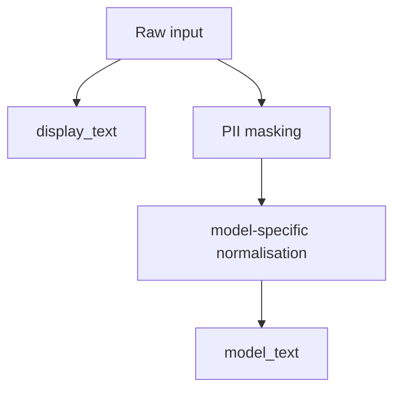

# 1. النص وUnicode والمعالجة  
# Text, Unicode, and Preprocessing

## لماذا يبدأ NLP قبل النموذج؟

قد ترى العين نصين متطابقين بينما يراهما الحاسوب سلسلتين مختلفتين. وقد يحذف “تنظيف” غير مدروس معلومة يحتاجها النموذج. لذلك المعالجة ليست تجميلًا؛ إنها **عقد بيانات** يجب أن يطابق التدريب والتقييم والخدمة.

**English recap:** Preprocessing is a versioned data contract, not cosmetic cleaning.

## 1.1 أربع طبقات لا تخلط بينها

| الطبقة | السؤال |
|---|---|
| الرمز المرئي | ماذا يرى الإنسان على الشاشة؟ |
| Unicode code point | ما الرقم المعياري للرمز؟ |
| UTF-8 bytes | كيف خُزّن النص؟ |
| Token ID | كيف حوّله tokenizer الخاص بالنموذج؟ |

الحرف المرئي ليس دائمًا code point واحدًا؛ بعض العلامات مركبة. يعرّف Unicode أشكال Normalisation لتحقيق تمثيل موحد للنصوص المتكافئة. نستخدم `NFC` كخط أساس محافظ، وفق [Unicode UAX #15](https://unicode.org/reports/tr15/) و[توثيق Python `unicodedata`](https://docs.python.org/3/library/unicodedata.html).

### مثال قابل للنسخ

```python
import unicodedata

text = "خِدمة"
for char in text:
    print(char, f"U+{ord(char):04X}", unicodedata.name(char, "UNKNOWN"))

nfc = unicodedata.normalize("NFC", text)
assert nfc.encode("utf-8").decode("utf-8") == nfc
```

**تحقق:** التشكيل قد يظهر مرتبطًا بالحرف، لكنه code point مستقل. لا تحذفه إلا بقرار.

## 1.2 عقد النسختين | Two-copy contract



- `display_text`: ما سيُعرض بأمان للمستخدم أو المراجع، من دون تغيير لغوي غير لازم.
- `model_text`: النسخة التي تدخل tokenizer بعد الحماية والprofile المعلن.

لا تستخدم `model_text` للعرض إذا كانت مطبّعة بقوة، ولا تطبع raw text في logs قبل masking.

## 1.3 الحماية قبل السجل

مثال الدورة يخفي البريد والهاتف السعودي في الأنماط المدعومة:

```python
from src.bayan.preprocessing import mask_pii

safe = mask_pii("راسل test@example.invalid أو اتصل 0500000000")
print(safe)
# راسل [EMAIL] أو اتصل [PHONE]
```

هذا الكود **تعليمي محدود** وليس نظام اكتشاف PII إنتاجيًا. في الإنتاج تحتاج policy ومصادر متعددة واختبارات تغطية ومراجعة قانونية.

## 1.4 تقسيم الجمل باستخدام spaCy

تقسيم المستند إلى جمل مرحلة مستقلة قابلة للاختبار، خصوصًا قبل chunking أو تطبيق حدود طول النموذج. لا يكفي `text.split(".")` لأنه لا يفهم علامات الاستفهام، والقوائم، والاختصارات، أو اختلاف الكتابة العربية والإنجليزية.

يستخدم المختبر `spacy.blank("xx")` مع `sentencizer` القاعدي حتى يعمل بلا تنزيل نموذج لغوي:

```python
import spacy

nlp = spacy.blank("xx")
nlp.add_pipe("sentencizer")
sentences = [sent.text.strip() for sent in nlp("الخدمة جيدة. لم يصل الرمز!").sents]
assert sentences == ["الخدمة جيدة.", "لم يصل الرمز!"]
```

هذا baseline قاعدي قابل للاختبار، وليس segmenter إنتاجيًا. يسجل المختبر اختبار اختصار معروفًا مثل `د. أحمد` حتى لا يختفي العيب خلف نتيجة نجاح عامة. ويدخل spaCy **نسخة النموذج المحمية** نفسها، فتظل قاعدة train/serve consistency قائمة.

## 1.5 ما معنى Normalisation؟

هي تحويل معلن يجعل بعض الأشكال تتطابق. لكنها قد تكون:

- **شكلية آمنة نسبيًا:** NFC، ضبط المسافات.
- **قرارًا عربيًا:** حذف التطويل، إزالة التشكيل، توحيد الألف.
- **مدمرة للمعلومة:** تحويل التاء المربوطة أو حذف رموز تميز أسماء/كيانات بلا قياس.

### profiles المقترحة

| Profile | التحويل | متى؟ |
|---|---|---|
| `display` | لا تغيير لغوي | العرض والمراجعة |
| `conservative` | NFC + مسافات + إزالة التطويل | خط أساس اليوم |
| `model_specific` | ما يطابق وصف checkpoint | عندما يوجد دليل |
| `aggressive_experiment` | إزالة تشكيل/توحيد ألف/ياء | تجربة مقاسة، لا افتراض |

### مثال

```python
from src.bayan.preprocessing import normalize_arabic

text = "  الخـدمةُ   ممتازة  "
print(normalize_arabic(text))
# الخدمةُ ممتازة

print(normalize_arabic(
    text,
    remove_diacritics=True,
    normalize_alef=True,
))
# الخدمة ممتازة
```

## 1.6 قاعدة القرار العربي

اسأل قبل أي تحويل:

1. هل استُخدم في pretraining لذلك checkpoint؟
2. هل المهمة تحتاج المعلومة التي سأحذفها؟
3. هل طبّقته بالطريقة نفسها في train وserve؟
4. هل قست أثره حسب اللغة/اللهجة/الفئة؟
5. هل بقيت نسخة العرض الأصلية؟

إذا لم تعرف الإجابة، استخدم profile محافظًا وسجّل القرار بوصفه قابلًا للمراجعة.

## 1.7 أخطاء شائعة

| الخطأ | لماذا خطير؟ | التصحيح |
|---|---|---|
| `lower()` لكل اللغات | قد يغير الإنجليزية بينما العربية بلا case | اربطه بالنموذج والمهمة |
| حذف كل punctuation | يفقد سؤالًا أو نفيًا أو حدود كيان | قس قبل الحذف |
| استبدال ة بـه | يغير الكتابة والمعنى وقد يضر NER | لا تستخدمه افتراضيًا |
| توحيد ى/ي دائمًا | قد يختلف عن وصف checkpoint | profile صريح فقط |
| حذف التشكيل دائمًا | قد يزيل تمييزًا مهمًا | تجربة مقاسة |
| logging قبل masking | تسرب خصوصية | احمِ قبل الطباعة |
| profile مختلف في الخدمة | train/serve skew | وحدة واحدة versioned |

## نشاط: أي نسخة تدخل أين؟

للنص:

`"  أحتاجُ متابعة الطلب عبر user@example.invalid  "`

اكتب:

- `display_text`
- `model_text` المحافظ
- transformation log
- معلومة قررت الحفاظ عليها ولماذا

لا توجد إجابة “أنظف” مطلقة؛ توجد إجابة موثقة متوافقة مع المهمة.

## ملخص | Summary

- النص له تمثيل مرئي وUnicode وbytes وtokens.
- NFC يحل canonical equivalence، لكنه لا يقرر سياسات العربية نيابة عنك.
- احتفظ بنسختين: display وmodel.
- masking يسبق logs والنشر.
- تقسيم الجمل مرحلة قابلة للاختبار، وspaCy لا يلغي الحاجة إلى اختبارات الاختصارات.
- normalisation قرار نموذج/مهمة ويجب أن يتطابق في التدريب والخدمة.
