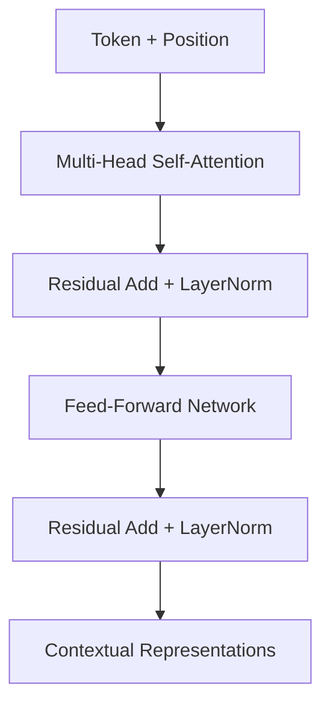

# 3. Attention وTransformer  
# Attention and Transformer Encoders

## الفكرة في دقيقة واحدة

اقرأ:

```text
الطلب لم يصل اليوم
```

لفهم كلمة **«يصل»**، يحتاج النموذج إلى ملاحظة **«لم»** لأنها تغيّر المعنى.
**Self-Attention** تسمح لكل Token أن تنظر إلى Tokens الأخرى، وتعطي كل واحدة وزنًا، ثم تمزج معلوماتها.

> **Attention = قارن الكلمات، أعطها أوزانًا، ثم اجمع المعلومات المهمة.**

---

## 3.1 ما معنى Q وK وV؟

| الرمز | الاسم | المعنى البسيط |
|---|---|---|
| **Q** | Query | ما المعلومة التي أبحث عنها؟ |
| **K** | Key | ما المعلومة التي أقدمها للمطابقة؟ |
| **V** | Value | ما المحتوى الذي سأمرره؟ |

عند معالجة «يصل»:

1. «يصل» ترسل **Q**.
2. جميع Tokens تعرض **K**.
3. النموذج يقارن Q مع كل K.
4. يستخدم الأوزان لجمع المعلومات من **V**.

> **احفظيها هكذا:** Q تسأل، K تطابق، V تنقل المعلومة.

---

## 3.2 شرح المعادلة دون تعقيد

$$
\operatorname{Attention}(Q,K,V)
=
\operatorname{softmax}\left(
\frac{QK^\top}{\sqrt{d_k}}
\right)V
$$

نقرأها في أربع خطوات:

| الخطوة | العملية | معناها |
|---:|---|---|
| 1 | $QK^\top$ | قارن كل Query بجميع Keys لتحصل على Scores. |
| 2 | $\div\sqrt{d_k}$ | خفّض تضخم الأرقام حتى يبقى التعلم مستقرًا. |
| 3 | Softmax | حوّل Scores إلى أوزان موجبة مجموعها 1. |
| 4 | $\times V$ | اجمع Values حسب الأوزان لتنتج تمثيلًا سياقيًا. |

> **الخلاصة:** قارن → قسّم → وزّع الأوزان → امزج المعلومات.

هذه هي **Scaled Dot-Product Attention** من ورقة [Attention Is All You Need](https://papers.nips.cc/paper/7181-attention-is-all-you-need).

### لماذا نقسم على $\sqrt{d_k}$؟

عندما يكبر عدد الأبعاد، قد تكبر Scores كثيرًا فيصبح Softmax حادًا جدًا ويصعب التعلم. القسمة على $\sqrt{d_k}$ تبقي القيم أكثر استقرارًا.

> نقسم على **بُعد الرأس** $\sqrt{d_k}$، وليس على $d_k$ ولا على $\sqrt{d_{model}}$.

---

## 3.3 مثال صغير

هذه أوزان تعليمية محتملة عندما تعالج Token «يصل»:

| Token | الوزن |
|---|---:|
| الطلب | 0.10 |
| لم | 0.55 |
| يصل | 0.25 |
| اليوم | 0.10 |
| **المجموع** | **1.00** |

الوزن الأعلى لـ«لم» يعني أن معلوماتها ستؤثر أكثر في التمثيل الجديد لـ«يصل».

> الأرقام توضيحية؛ الأوزان الحقيقية تختلف حسب النموذج والطبقة والرأس والسياق.

### Shapes في المثال

إذا كان لدينا 4 Tokens وكان $d_k=4$:

```text
Q, K, V        = [4, 4]
Scores/Weights = [4, 4]
Output         = [4, 4]
```

- الصف يمثل Query الحالية.
- العمود يمثل Key التي تنظر إليها.
- مجموع كل صف بعد Softmax يساوي 1.

---

## 3.4 تطبيق مختصر

```python
import numpy as np
from src.bayan.attention import scaled_dot_product_attention

q = np.eye(4)
k = np.eye(4)
v = np.arange(16, dtype=float).reshape(4, 4)

output, weights = scaled_dot_product_attention(q, k, v)

assert weights.shape == (4, 4)
assert output.shape == (4, 4)
assert np.allclose(weights.sum(axis=-1), 1.0)

print(weights.round(3))
```

الكود يثبت ثلاثة أشياء: شكل الأوزان صحيح، شكل الناتج صحيح، ومجموع كل صف يساوي 1.

---

## 3.5 ما وظيفة Mask؟

Mask تقول للنموذج: **لا تستخدم هذه المواضع.**

| النوع | الاستخدام |
|---|---|
| Padding mask | يمنع `[PAD]` من التأثير في النص الحقيقي. |
| Causal mask | يمنع Decoder من رؤية Tokens المستقبلية. |

الترتيب الصحيح:

```text
Scores → Mask → Softmax → Weights → Output
```

نطبق Mask **قبل Softmax**. وفي دالة الدورة، `True` تعني: اسمح لهذا الموضع بالمشاركة. قد تختلف الدلالة بين بعض الواجهات، لذلك راجع [عقد دالة PyTorch](https://docs.pytorch.org/docs/stable/generated/torch.nn.functional.scaled_dot_product_attention.html).

---

## 3.6 Multi-Head Attention

بدل تشغيل Attention في مساحة واحدة، نقسم التمثيل إلى عدة رؤوس، ثم ندمج النتائج:

```text
Split → Attention in each head → Concatenate → Project
```

مثال الدورة:

```text
d_model = 12
heads = 3
head_dim = 12 ÷ 3 = 4
```

وفي BERT-base:

```text
768 = 12 heads × 64 dimensions
```

تعدد الرؤوس يسمح بتعلم أنماط تفاعل مختلفة، لكنه لا يضمن أن لكل رأس تفسيرًا لغويًا واضحًا.

---

## 3.7 لماذا نضيف معلومات الموضع؟

Attention وحدها لا تعرف ترتيب الكلمات. لذلك يضيف Transformer معلومات موضعية.

```text
المدير شكر الموظف
الموظف شكر المدير
```

الكلمات نفسها تقريبًا، لكن الترتيب غيّر المعنى. **Positional Information** تساعد النموذج على معرفة من جاء أولًا.

---

## 3.8 كتلة Transformer Encoder



| الجزء | دوره ببساطة |
|---|---|
| Attention | يجمع السياق من Tokens الأخرى. |
| Residual | يحافظ على مسار للمعلومة الأصلية. |
| LayerNorm | يساعد على استقرار القيم. |
| Feed-Forward Network | يحوّل تمثيل كل موضع بعد جمع السياق. |

تكرار هذه الكتلة يبني تمثيلات أعمق. BERT هو مكدس من Encoder blocks، ثم نضيف إليه Task Head مناسبًا للمهمة. راجع [ورقة BERT](https://arxiv.org/abs/1810.04805).

---

## 3.9 أي عائلة نختار؟

| العائلة | مناسبة عادةً لـ |
|---|---|
| Encoder | Classification، NER، Embeddings |
| Decoder | Text generation |
| Encoder–Decoder | Translation، Summarisation |

يركز البرنامج على Encoder models لأنها مناسبة لمهام التصنيف وNER وExtractive QA التي سنطبقها.

---

## 3.10 لماذا يصبح النص الطويل مكلفًا؟

لطول تسلسل يساوي $n$، تبني Attention مصفوفة $n\times n$، لذلك تزداد الكلفة تقريبًا مع $O(n^2)$.

```text
128 Tokens → 1×
256 Tokens → 4×
512 Tokens → 16×
```

لهذا نقيس أطوال البيانات، ونقلل Padding، ونستخدم Chunking عند الحاجة.

---

## 3.11 هل Attention تفسّر القرار؟

Attention maps مفيدة لفحص الأوزان واكتشاف أخطاء مثل انتباه النموذج إلى `[PAD]`. لكنها لا تثبت وحدها أن Token معينة **سببت** القرار.

> **Attention map = أوزان حسبها رأس محدد.**
> **Attention map ≠ تفسير سببي كامل.**

راجع مناقشة [Jain & Wallace, 2019](https://aclanthology.org/N19-1357/).

---

## أكثر الأخطاء شيوعًا

1. القسمة على قيمة غير $\sqrt{d_k}$.
2. تطبيق Mask بعد Softmax.
3. نسيان Padding mask.
4. الخلط بين صف Query وعمود Key.
5. نسيان معلومات الموضع.
6. تقديم Attention heatmap كتفسير نهائي.

---

## الخلاصة

```text
Tokens
→ Q, K, V
→ QKᵀ / √dₖ
→ Mask
→ Softmax
→ Weighted mix of V
→ Contextual representations
```

- Q تسأل، K تطابق، V تنقل المعلومة.
- Softmax يحول Scores إلى أوزان مجموعها 1.
- Mask تطبق قبل Softmax.
- Multi-Head تكرر الفكرة في عدة رؤوس.
- معلومات الموضع تحفظ ترتيب الكلمات.
- Encoder block تجمع Attention وResidual وLayerNorm وFFN.

## سؤال تحقق سريع

إذا كان `d_model=12` و`heads=3`:

```text
head_dim = 4
shape after split = [batch, 3, sequence, 4]
scores = [batch, 3, sequence, sequence]
```

## الخطوة التالية

شغّل [Notebook 02 — Attention & Transformers](../notebooks/02_attention_transformers.ipynb)، وتأكد من ظهور:

```text
DAY1_NOTEBOOK2_CORE=PASS
```

ثم انتقل إلى [بوابة اليوم الأول](04-labs-checkpoint.md).

## English recap

Self-attention compares queries with keys, scales and masks the scores, applies softmax, and uses the resulting weights to mix values. A Transformer encoder combines multi-head attention, residual paths, LayerNorm, and a feed-forward network to create contextual token representations.
