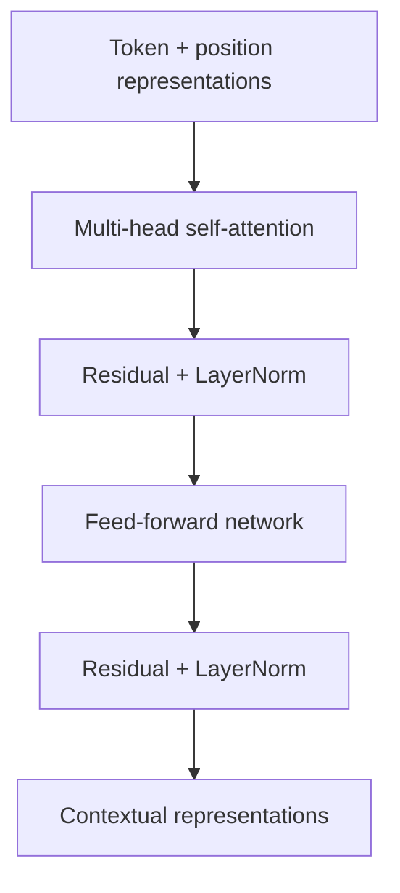

# 3. Attention وTransformer  
# Attention and Transformer Encoders

## المشكلة التي يحلها Attention

في جملة «لم تتأخر الخدمة»، معنى «تتأخر» يتأثر بـ«لم». يحتاج كل موضع إلى جمع معلومات من مواضع أخرى. self-attention يبني هذا المزج مباشرة.

## 3.1 Q وK وV

لكل token representation نحسب ثلاثة إسقاطات:

- **Query (Q):** ما المعلومات التي أبحث عنها؟
- **Key (K):** ما نوع المعلومات التي أقدمها؟
- **Value (V):** ما المحتوى الذي سينتقل إذا حصلت على وزن؟

التشبيه يساعد على البداية لكنه ليس تعريفًا رياضيًا. التعريف:

[
operatorname{Attention}(Q,K,V)
=
operatorname{softmax}left(
rac{QK^	op}{sqrt{d_k}}

ight)V
]

هذه معادلة scaled dot-product attention في ورقة [Attention Is All You Need](https://papers.nips.cc/paper/7181-attention-is-all-you-need).

## 3.2 خطوة بخطوة

لنفترض sequence من 4 tokens وdimension يساوي 4:

| العملية | Shape |
|---|---|
| (Q) | (4 	imes 4) |
| (K^	op) | (4 	imes 4) |
| scores (QK^	op) | (4 	imes 4) |
| softmax weights | (4 	imes 4) |
| (V) | (4 	imes 4) |
| output | (4 	imes 4) |

كل صف في weights يجيب: إلى أي keys ينظر query الحالي؟ مجموع الصف يساوي 1، إلا إذا كانت الخوارزمية/القناع لهما معالجة خاصة.

```python
import numpy as np
from src.bayan.attention import scaled_dot_product_attention

q = np.eye(4)
k = np.eye(4)
v = np.arange(16, dtype=float).reshape(4, 4)

output, weights = scaled_dot_product_attention(q, k, v)
assert output.shape == (4, 4)
assert np.allclose(weights.sum(axis=-1), 1.0)
print(weights.round(3))
```

## 3.3 لماذا نقسم على (sqrt{d_k})؟

عندما يكبر (d_k)، قد تكبر dot products فيدخل softmax منطقة شديدة الحدة وتضعف gradients. scaling يثبت حجم scores نسبيًا. لا يعني ذلك أن كل head يصبح متساويًا؛ بل يمنع تضخمًا منهجيًا بسبب dimension.

## 3.4 ما وظيفة Mask؟

القناع يمنع مواضع من المشاركة:

- **Padding mask:** يمنع الحشو من التأثير.
- **Causal mask:** يمنع token من رؤية المستقبل في decoder.
- **Task mask:** قيد خاص بالمهمة.

في دالة الدورة، `True` يعني **اسمح بالمشاركة**، وهو متسق مع boolean mask في PyTorch `scaled_dot_product_attention`. انتبه: [توثيق PyTorch الرسمي](https://docs.pytorch.org/docs/stable/generated/torch.nn.functional.scaled_dot_product_attention.html) ينبه إلى اختلاف معنى boolean mask في بعض واجهات `MultiheadAttention`. اقرأ عقد الدالة، لا تعتمد على الذاكرة.

## 3.5 Multi-head Attention

بدل مساحة واحدة كبيرة، نقسم التمثيل إلى رؤوس. كل head يتعلم projections مختلفة، ثم تجمع النتائج:

[
operatorname{MultiHead}(Q,K,V)
=
operatorname{Concat}(head_1,ldots,head_h)W^O
]

هذا لا يضمن أن كل رأس يمثل قاعدة لغوية قابلة للتسمية، لكنه يسمح بمساحات تفاعل متعددة.

### شرط shape

إذا كان `d_model=12` و`num_heads=3`، فـ`head_dim=4`. يجب أن يقبل `d_model` القسمة على عدد الرؤوس في البناء المعتاد.

## 3.6 أين الموضع؟

self-attention وحده لا يعرف ترتيب الكلمات؛ يحتاج positional information. أضاف Transformer الأصلي positional encodings إلى token embeddings. نماذج حديثة قد تستخدم آليات موضعية مختلفة، لكن الفكرة الثابتة: لا بد من تمثيل الترتيب.

## 3.7 كتلة Encoder



- **Residual connection:** يضيف input إلى transformation ويساعد تدفق المعلومات.
- **LayerNorm:** يثبت تمثيل كل مثال/موضع وفق تصميم الطبقة.
- **FFN:** شبكة تطبق على كل موضع مع weights مشتركة عبر المواضع.
- **Stack:** تكرار الكتلة يبني تمثيلات أعمق.

## 3.8 Encoder أم Decoder؟

| العائلة | كيف ترى السياق؟ | أمثلة استخدام |
|---|---|---|
| Encoder | السياق في الاتجاهين عادةً | classification، NER، embeddings |
| Decoder | causal؛ الماضي فقط عند التوليد | text generation |
| Encoder–Decoder | encoder للمدخل وdecoder للمخرج | translation، summarisation |

برنامجنا يركز على encoder models لأنها مناسبة لمهام BERT المستهدفة ومقتصدة في مهام التصنيف المنظمة.

## 3.9 أين يقع BERT؟

BERT اختصار **Bidirectional Encoder Representations from Transformers**. قدمت [ورقة BERT الأصلية](https://arxiv.org/abs/1810.04805) pretraining ثنائي الاتجاه باستخدام masked language modelling، ثم fine-tuning لمهام متعددة. اليوم نفهم البنية؛ في اليوم الثاني نكيّفها للتصنيف وNER وQA.

## 3.10 التعقيد

self-attention الكامل يبني مصفوفة (n 	imes n) لطول sequence (n)، لذلك كلفة جزء attention في الطول تربيعية تقريبًا (O(n^2)). أول تحسين مجاني ليس شراء جهاز؛ بل اختيار طول مدخل مبني على البيانات، وتقليل padding، وchunking عندما يلزم.

## 3.11 هل attention تفسير؟

يمكن عرض weights لفهم ما حسبته طبقة معينة، لكن لا تقدمها كبرهان سببي بأن token هو سبب القرار. أظهرت أبحاث مثل [Jain & Wallace, 2019](https://aclanthology.org/N19-1357/) أن attention القياسي لا ينبغي معاملته تلقائيًا كتفسير موثوق. في الدورة نسمي الشكل **visualisation of weights** لا **proof of reasoning**.

## نشاط shapes

أكمل:

- batch = 2
- sequence = 8
- d_model = 12
- heads = 3
- head_dim = ?
- shape بعد split heads = ?
- score matrix لكل head = ?

الإجابة التي تستطيع الدفاع عنها يجب أن تذكر ترتيب الأبعاد الذي اخترته، مثل `[batch, heads, sequence, head_dim]`.

## English recap

Self-attention computes scaled similarities between queries and keys, applies a mask and softmax, then mixes values. Multi-head attention repeats the idea in several learned subspaces. An encoder block combines self-attention, residual paths, normalisation, and a feed-forward network. Attention weights are useful internals, not automatic causal explanations.
