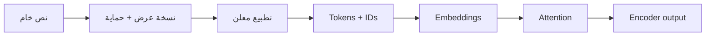

# اليوم الأول — من النص إلى Tensor  
# Day 1 — From Text to Tensor

**إعداد وتقديم | Prepared and delivered by:** ميعاد المري · Meaad Al-Marri  
**المسار:** رحلة تعلم تطبيقية · **البيئة:** Google Colab Free + GitHub

<!-- BAYAN_YOUTUBE_START -->
## فيديوهات هذا اليوم | Videos for this day

[▶ افتح فيديوهات اليوم 1 حسب الموضوع · Open Day 1 video companions](VIDEOS.md)

توجد أزرار المشاهدة كذلك داخل الدروس التفصيلية في موضع الموضوع. · Direct video buttons also appear in the related detailed lessons.
<!-- BAYAN_YOUTUBE_END -->

## سؤال اليوم | Driving question

> كيف تتحول جملة مثل «الخدمة ممتازة» إلى مصفوفات يستطيع Transformer معالجتها، وما الذي قد يفسد في الطريق؟

اليوم لا نحفظ أسماء مكتبات فقط؛ سنبني المسار كاملًا ونفحص كل انتقال:

**English:** We follow a bilingual sentence from raw text to protected model text, tokens, IDs, embeddings, self-attention, and an encoder representation.

## بنهاية اليوم ستتمكن من

1. فحص Unicode دون إفساد العربية.
2. فصل نسخة العرض عن نسخة النموذج.
3. تطبيق masking وnormalisation وتقسيم الجمل بـspaCy بقرارات صريحة.
4. تفسير token وsubword وspecial token.
5. قياس token fertility وخطر truncation.
6. شرح الفرق بين token ID وembedding.
7. حساب scaled dot-product attention وفحص shapes.
8. رسم Transformer encoder block وشرح دور كل جزء.
9. تسليم بوابة بيان A باختبارات خضراء وقرار tokenizer.

## رحلة اليوم | Learning journey

| English topic | الموضوع والشرح بالعربية |
|---|---|
| **The Bayan problem** — Turn Arabic and English feedback into an inspectable analysis. Distinguish a teaching prototype from a service that makes real decisions. | **مشكلة بيان** — نحوّل ملاحظات عربية وإنجليزية إلى تحليل يمكن فحصه. نحدد المستفيد وما ينتجه المشروع، ونفصل النموذج التعليمي عن خدمة تتخذ قرارات حقيقية. |
| **Text, Unicode and privacy** — Inspect text encoding, keep a safe display copy and create a model copy with documented masking and normalisation. | **النص وUnicode والخصوصية** — نفحص ترميز النص، ونحتفظ بنسخة عرض آمنة، وننشئ نسخة للنموذج مع إخفاء المعرّفات وتوثيق التطبيع. لا ننشر نصًا شخصيًا خامًا. |
| **Tokens and embeddings** — Compare words and subwords; measure fragmentation and truncation. Token IDs are vocabulary positions, while embeddings are learned vectors. | **الترميز والتضمينات** — نميّز الكلمات والوحدات الجزئية ونقيس التجزئة والقطع. رقم الرمز موضع في القاموس؛ أما التضمين فهو متجه عددي متعلّم. |
| **Attention and Q/K/V** — Trace a small attention computation: queries compare with keys, and the resulting weights combine values. Check tensor shapes and masks. | **الانتباه وQ/K/V** — نتتبع حسابًا صغيرًا: تقارن الاستعلامات بالمفاتيح، وتستخدم الأوزان الناتجة لدمج القيم. نفحص أبعاد المصفوفات وأقنعة الانتباه. |
| **Transformer encoder** — Connect multi-head attention, residual paths, normalisation and feed-forward layers; inspect a real forward pass and explain the limits of attention visualisation. | **مشفر المحوّل** — نربط الانتباه متعدد الرؤوس بالمسارات المتبقية والتطبيع والطبقات الأمامية، ونفحص تمريرًا فعليًا مع توضيح حدود تفسير خرائط الانتباه. |

**Architecture:** Synthetic AR/EN text → Privacy + profile → Tokens → vectors → Encoder + attention checks

**المسار المعماري:** نص عربي/إنجليزي اصطناعي ← حماية + معالجة موثقة ← رموز ← تمثيل عددي ← مشفر + فحوص الانتباه

**الدليل:** اختبارات المعالجة + قرار الترميز + فحوص الانتباه + commit

[المشروع وهيكله](../docs/project-walkthrough.md) · [التشغيل والحفظ خطوة بخطوة](../docs/learner-workflow.md) · [تقييم 100 درجة](../docs/policies/assessment-and-completion.md)

## دفاتر اليوم | Notebooks

| الدفتر | الغرض | التكلفة |
|---|---|---|
| [01 — Text Processing & Tokenisation](../notebooks/01_text_processing_tokenization.ipynb) | Unicode، masking، profiles، spaCy، WordPiece، fertility، embeddings | مجاني، CPU |
| [02 — Attention & Transformers](../notebooks/02_attention_transformers.ipynb) | Q/K/V، scaling، masks، multi-head، تدقيق معاملات وforward فعلي | مجاني، CPU |

## مستويات اليوم

### 🟢 Core — للجميع

- تشغيل الدفترين بالترتيب.
- نجاح اختبارات preprocessing وattention.
- مقارنة العربية والإنجليزية في fertility.
- كتابة قرار tokenizer من 4 أسطر.
- commit بوابة اليوم.

### 🔵 Explore

- قارن profile عربيين وسجّل ما تغير في token count.
- قس truncation rate عند طولين.
- غيّر keep mask وفسّر النتيجة.

### 🟣 Distinction

- أضف slice للهجة أو Arabizi دون تغيير النص الأصلي.
- قارن tokenizer إضافيًا موثقًا مع المعيار نفسه.
- تحقق عدديًا من PyTorch SDPA على أكثر من seed.

## قواعد اليوم

- لا تنظف النص قبل أن تحفظ نسخة عرض آمنة.
- لا تستخدم normalization لأن شكل النص “أجمل”.
- لا تفصل tokenizer عن checkpoint الذي ينتمي إليه.
- لا تعامل token ID كأنه معنى؛ المعنى المتعلم في embedding/model.
- لا تعرض attention heatmap كبرهان سببي على تفسير القرار.
- لا تنتقل إلى Explore قبل نجاح Core.

## نقطة البداية

1. شغّل [Runtime Doctor](../notebooks/00_runtime_doctor.ipynb).
2. افتح الدفتر 01 واحفظ نسخة في Drive.
3. أبقِ هذه الصفحة في تبويب منفصل للعودة إلى التعريفات.
4. عند ظهور خطأ استخدم [دليل الأعطال](../docs/setup/troubleshooting.md).

## قاموس اليوم

[افتح قاموس اليوم الأول](GLOSSARY.md) واتركه في تبويب مستقل أثناء الشرح والمختبر. يضم المصطلح الإنجليزي، والنطق، والتعريف بالإنجليزية، والشرح العربي، ومثالًا تطبيقيًا لكل مفهوم في المعالجة وTokenisation وAttention وTransformers. يبقى [قاموس الدورة الكامل](../docs/glossary/README.md) مرجعًا جامعًا عبر الأيام الأربعة.

## مراجع اليوم

جميع الادعاءات التقنية مرتبطة بمصادرها الأولية في [REFERENCES.md](REFERENCES.md).
