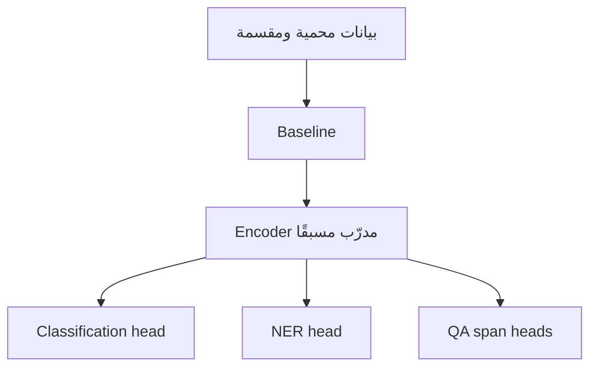

# اليوم الثاني — اجعل النموذج متخصصًا
# Day 2 — Make the Model Yours

**إعداد وتقديم | Prepared and delivered by:** ميعاد المري · Meaad Al-Marri  
**الوقت:** 6 ساعات صافية · 300 دقيقة شرح + 60 دقيقة لاب · **البيئة:** Google Colab Free + GitHub

> **السؤال المحوري:** كيف نحول مشفرًا لغويًا عامًا إلى ثلاثة نماذج تحل مهامًا محددة، من دون تسرب بيانات أو أرقام مضللة؟
>
> **Driving question:** How do we adapt a general language encoder to three tasks without leakage or misleading metrics?

## قبل البدء

يجب أن تكون بوابة اليوم الأول A مكتملة:

- preprocessing وPII masking يعملان.
- قرار tokenizer موثق.
- دفترا اليوم الأول يصلان إلى PASS.
- ملفات المشروع محفوظة في GitHub.

إذا لم تكتمل، استخدم [نقطة استعادة اليوم الأول](../day-01/04-labs-checkpoint.md) قبل بدء التدريب.

## نواتج اليوم | Outcomes

بنهاية اليوم تستطيع:

1. تفسير الفرق بين pretraining وfine-tuning وtask head.
2. بناء TF-IDF baseline قبل Transformer.
3. تجهيز train/validation/frozen-test مع منع تداخل `group_id`.
4. تنفيذ ضبط فعلي لنموذج BERT متعدد اللغات لتصنيف الموضوع، ثم إعادة استخدام العقد لرأس sentiment المستقل في المشروع.
5. محاذاة BIO labels مع subwords باستخدام `word_ids()` و`-100`.
6. تجهيز وتدريب نموذج NER وقياسه على مستوى الكيان.
7. تجهيز extractive QA واختيار span صالح أو إرجاع no-answer.
8. إكمال Gate B في مشروع بيان وحفظ الأدلة في GitHub.

## قاموس اليوم | Day glossary

[افتح قاموس اليوم الثاني](GLOSSARY.md) واتركه في تبويب مستقل. يغطي Fine-tuning والتقسيم والمقاييس وNER ومحاذاة BIO وExtractive QA واختيار النموذج، مع النطق والتعريف الإنجليزي والشرح العربي ومثال لكل مصطلح. يمكن الرجوع كذلك إلى [قاموس الدورة الكامل](../docs/glossary/README.md).

## جدول اليوم

| الفترة | المدة | English | العربية |
|---|---:|---|---|
| 1 | 60 min | Pretraining, fine-tuning and task heads | التدريب المسبق والضبط الدقيق ورؤوس المهام |
| 2 | 60 min | TF-IDF baseline, honest splits and macro-F1 | خط أساس TF-IDF والتقسيم السليم وmacro-F1 |
| 3 | 60 min | NER, BIO labels and subword alignment | الكيانات ووسوم BIO ومحاذاة الوحدات الجزئية |
| 4 | 60 min | Extractive QA, valid spans and no-answer | الأسئلة الاستخراجية والمقاطع الصالحة وعدم وجود إجابة |
| 5 | 60 min | Arabic model choices and a guided trace of the training notebooks | اختيار النماذج العربية وتتبع موجّه لدفاتر التدريب |
| 6 | 60 min | Dedicated lab + B | لاب مستقل + B |

التوزيع الجديد: **300 دقيقة شرح + 60 دقيقة لاب**. الاستراحات ونوافذ الاختبارات والعروض خارج ساعات التعلم الصافية. [تفاصيل التنفيذ والاستعادة](../docs/04-delivery-plan.md).

## خط الأنابيب الذي سنبنيه

المشفر العام نقطة بداية مشتركة، لكن كل مهمة لها شكل labels وloss وmetric مختلف.

## المسارات

- 🟢 **Core:** البيانات المصغرة + خطوة تدريب فعلية + اختبارات الصحة. إلزامي.
- 🔵 **Explore:** epoch إضافي أو مقارنة frozen encoder مع full fine-tuning.
- 🟣 **Distinction:** ثلاث بذور أو تحليل per-language، بعد Core فقط.

## الموارد والتكلفة

المسار الإلزامي مجاني ولا يحتاج API key:

- Google Colab Free؛ GPU غير مضمون.
- نموذج Hugging Face عام بترخيص Apache-2.0.
- GitHub Public.
- Python وPyTorch وTransformers وscikit-learn مفتوحة المصدر.

Colab Pro أو خدمات الاستدلال المستضافة خيارات مدفوعة قد توفر موارد أو استضافة، لكنها ليست مطلوبة ولا تمنح نقاطًا إضافية. إذا لم يتوفر GPU، يجمد notebook المشفر ويدرب task head على CPU لتقليل الوقت، مع تسجيل ذلك بوضوح.

## قاعدة الصدق العلمي

العينات صغيرة ومصطنعة. أي نتيجة منها تسمى:

`MEASURED_SMOKE`

ولا تسمى «دقة النموذج النهائية». الغرض إثبات سلامة المسار، لا إثبات جاهزية إنتاجية.

## مخرج بيان اليوم

عند Gate B يملك كل متدرب:

- baseline موثق.
- zero group overlap.
- classification training smoke.
- عقد labels للموضوع والمشاعر؛ `sentiment` موجود في بيانات اليوم ويُدرّب كرأس مستقل في تجميع المشروع.
- NER alignment tests.
- NER training smoke.
- QA training smoke + valid span + honest null.
- قرار أولي بين نموذج متعدد اللغات ونموذج عربي.
- commit عام واحد يربط الأدلة.
