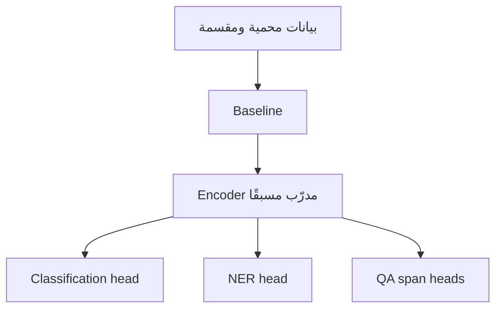

# اليوم الثاني — اجعل النموذج متخصصًا
# Day 2 — Make the Model Yours

**إعداد وتقديم | Prepared and delivered by:** ميعاد المري · Meaad Al-Marri  
**المسار:** رحلة تعلم تطبيقية · **البيئة:** Google Colab Free + GitHub

> **السؤال المحوري:** كيف نحول مشفرًا لغويًا عامًا إلى ثلاثة نماذج تحل مهامًا محددة، من دون تسرب بيانات أو أرقام مضللة؟
>
> **Driving question:** How do we adapt a general language encoder to three tasks without leakage or misleading metrics?

## قبل البدء

يجب أن تكون بوابة اليوم الأول A مكتملة:

- preprocessing وPII masking يعملان.
- قرار tokenizer موثق.
- دفترا اليوم الأول يصلان إلى PASS.
- ملفات المشروع محفوظة في GitHub.

إذا لم تكتمل، استخدم [نقطة استعادة اليوم الأول](../day-01/04-labs-checkpoint.md) قبل بدء التدريب.

## نواتج اليوم | Outcomes

بنهاية اليوم تستطيع:

1. تفسير الفرق بين pretraining وfine-tuning وtask head.
2. بناء TF-IDF baseline قبل Transformer.
3. تجهيز train/validation/frozen-test مع منع تداخل `group_id`.
4. تنفيذ ضبط فعلي لنموذج BERT متعدد اللغات لتصنيف الموضوع، ثم إعادة استخدام العقد لرأس sentiment المستقل في المشروع.
5. محاذاة BIO labels مع subwords باستخدام `word_ids()` و`-100`.
6. تجهيز وتدريب نموذج NER وقياسه على مستوى الكيان.
7. تجهيز extractive QA واختيار span صالح أو إرجاع no-answer.
8. إكمال Gate B في مشروع بيان وحفظ الأدلة في GitHub.

## قاموس اليوم | Day glossary

[افتح قاموس اليوم الثاني](GLOSSARY.md) واتركه في تبويب مستقل. يغطي Fine-tuning والتقسيم والمقاييس وNER ومحاذاة BIO وExtractive QA واختيار النموذج، مع النطق والتعريف الإنجليزي والشرح العربي ومثال لكل مصطلح. يمكن الرجوع كذلك إلى [قاموس الدورة الكامل](../docs/glossary/README.md).

## رحلة اليوم | Learning journey

| English topic | الموضوع والشرح بالعربية |
|---|---|
| **Pretraining and task heads** — Reuse a pretrained encoder and understand what changes during fine-tuning. Record whether the encoder is frozen in the CPU path. | **التدريب المسبق ورؤوس المهام** — نعيد استخدام مشفر مدرب مسبقًا ونفهم ما يتغير في الضبط الدقيق، ونسجل بصراحة هل جُمّد المشفر عند استخدام بديل CPU. |
| **Baseline and honest splits** — Create a TF-IDF baseline, keep groups separate across train/validation/test, then evaluate topic and sentiment with independent label contracts. | **خط الأساس والتقسيم السليم** — نبني خط أساس TF-IDF ونمنع تداخل المجموعات بين التدريب والتحقق والاختبار، ثم نقيس الموضوع والمشاعر بعقدي وسوم مستقلين. |
| **NER and label alignment** — Use BIO labels, align word labels to subwords and exclude special or ignored tokens from the loss as documented. Evaluate complete entities. | **الكيانات ومحاذاة الوسوم** — نستخدم وسوم BIO ونحاذي وسوم الكلمات مع الوحدات الجزئية ونستبعد الرموز الخاصة أو المهملة من حساب الخسارة وفق الدرس. نقيم الكيان كاملًا. |
| **Extractive QA and no-answer** — Select an answer span from the supplied context. When the context does not support an answer, return no-answer instead of generating text. | **الأسئلة الاستخراجية وعدم وجود إجابة** — نختار مقطع إجابة من السياق المقدم. عندما لا يدعم السياق الإجابة نعيد عدم وجود إجابة، ولا نولّد نصًا من خارج المصدر. |
| **Arabic model choice** — Compare Arabic and multilingual checkpoint assumptions, tokenizer compatibility and sample coverage; justify the choice with evidence. | **اختيار النموذج للعربية** — نقارن افتراضات النماذج العربية ومتعددة اللغات وتوافق المرمّز وتغطية العينة، ثم نبرر الاختيار بالدليل لا بالاسم الأشهر. |

**Architecture:** Protected, grouped data → Baseline + encoder → Topic / sentiment / NER / QA → Task metrics + Gate B

**المسار المعماري:** بيانات محمية ومقسمة ← خط أساس + مشفر ← موضوع / مشاعر / كيانات / أسئلة ← مقاييس المهام + بوابة B

**الدليل:** خط أساس + عدم تداخل المجموعات + أدلة التصنيف والكيانات والأسئلة + commit

[المشروع وهيكله](../docs/project-walkthrough.md) · [التشغيل والحفظ خطوة بخطوة](../docs/learner-workflow.md) · [تقييم 100 درجة](../docs/policies/assessment-and-completion.md)

## خط الأنابيب الذي سنبنيه

المشفر العام نقطة بداية مشتركة، لكن كل مهمة لها شكل labels وloss وmetric مختلف.

## المسارات

- 🟢 **Core:** البيانات المصغرة + خطوة تدريب فعلية + اختبارات الصحة. إلزامي.
- 🔵 **Explore:** epoch إضافي أو مقارنة frozen encoder مع full fine-tuning.
- 🟣 **Distinction:** ثلاث بذور أو تحليل per-language، بعد Core فقط.

## الموارد والتكلفة

المسار الإلزامي مجاني ولا يحتاج API key:

- Google Colab Free؛ GPU غير مضمون.
- نموذج Hugging Face عام بترخيص Apache-2.0.
- GitHub Public.
- Python وPyTorch وTransformers وscikit-learn مفتوحة المصدر.

Colab Pro أو خدمات الاستدلال المستضافة خيارات مدفوعة قد توفر موارد أو استضافة، لكنها ليست مطلوبة ولا تمنح نقاطًا إضافية. إذا لم يتوفر GPU، يجمد notebook المشفر ويدرب task head على CPU لتقليل الوقت، مع تسجيل ذلك بوضوح.

## قاعدة الصدق العلمي

العينات صغيرة ومصطنعة. أي نتيجة منها تسمى:

`MEASURED_SMOKE`

ولا تسمى «دقة النموذج النهائية». الغرض إثبات سلامة المسار، لا إثبات جاهزية إنتاجية.

## مخرج بيان اليوم

عند Gate B يملك كل متدرب:

- baseline موثق.
- zero group overlap.
- classification training smoke.
- عقد labels للموضوع والمشاعر؛ `sentiment` موجود في بيانات اليوم ويُدرّب كرأس مستقل في تجميع المشروع.
- NER alignment tests.
- NER training smoke.
- QA training smoke + valid span + honest null.
- قرار أولي بين نموذج متعدد اللغات ونموذج عربي.
- commit عام واحد يربط الأدلة.
