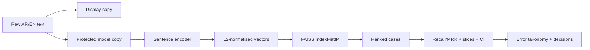

# اليوم الثالث — العربية، البحث، والحقيقة
# Day 3 — Arabic, Search, and Truth

**إعداد وتقديم | Prepared and delivered by:** ميعاد المري · Meaad Al-Marri  
**الوقت:** 6 ساعات صافية · 300 دقيقة شرح + 60 دقيقة لاب · **البيئة:** Google Colab Free + GitHub

> **السؤال المحوري:** كيف نبني بحثًا دلاليًا عربيًا/إنجليزيًا، ثم نثبت بصدق أين ينجح وأين يضعف؟
>
> **Driving question:** How do we build bilingual semantic search and produce evidence that shows both strengths and weaknesses?

## قبل البدء | Entry gate

يجب أن تكون [بوابة اليوم الثاني Gate B](../day-02/05-labs-checkpoint.md) مكتملة:

- معالجة النص موثقة ولا تحتوي بيانات حقيقية.
- تقسيم البيانات بلا تداخل `group_id`.
- مسارات classification وNER وQA تعمل.
- نتائج العينة موسومة `MEASURED_SMOKE`.
- التقدم محفوظ في مستودع GitHub العام للمتدرب.

إذا لم تكتمل، استخدم نقطة الاستعادة في Gate B ولا تبدأ تنزيل نموذج بحث جديد قبل حفظ اليوم الثاني.

## نواتج اليوم | Outcomes

بنهاية اليوم تستطيع:

1. تفسير أثر الصرف واللواصق والتنوع الإملائي واللهجات وArabizi على NLP العربية.
2. إنشاء نسخة عرض محفوظة ونسخة نموذج مطبّعة باستخدام CAMeL Tools وعقد واضح.
3. تنفيذ مقارنة ضبط دقيق مصغرة بين نموذج متعدد اللغات و`CAMeLBERT-DA` على شريحة خليجية مجمدة.
4. تمييز sentence embedding عن token embedding وعن مخرجات مصنف اليوم الثاني.
5. بناء فهرس `FAISS IndexFlatIP` بعد L2 normalisation على جانبي البحث.
6. تنفيذ بحث دلالي ثنائي اللغة بمشفّر جمل متعدد اللغات ثم إعادة ترتيب المرشحين بـcross-encoder.
7. قياس `Recall@k` و`MRR@k` وفرق الجودة/الزمن وضبط no-answer threshold على validation فقط.
8. إنشاء sliced evaluation مع bootstrap confidence intervals.
9. تحويل الأخطاء إلى taxonomy وإصلاحات مرتبة وتقرير مشروع.
10. إكمال Gate C وربط الأدلة في GitHub.

## قاموس اليوم | Day glossary

[افتح قاموس اليوم الثالث](GLOSSARY.md) واتركه في تبويب مستقل. يغطي صرف العربية واللهجات وArabizi وCAMeL Tools وSentence Embeddings وFAISS وRecall/MRR والتقييم بالشرائح وتحليل الأخطاء، مع النطق والتعريف الإنجليزي والشرح العربي ومثال لكل مصطلح. يمكن الرجوع كذلك إلى [قاموس الدورة الكامل](../docs/glossary/README.md).

## جدول اليوم | Schedule

| الفترة | المدة | English | العربية |
|---|---:|---|---|
| 1 | 60 min | Arabic morphology, dialects and safe normalisation | صرف العربية واللهجات والتطبيع الآمن |
| 2 | 60 min | CAMeL Tools and the measured Arabic-model comparison | أدوات CAMeL والمقارنة المقاسة بين النماذج العربية |
| 3 | 60 min | Sentence embeddings, cosine and FAISS | تضمينات الجمل وتشابه جيب التمام وFAISS |
| 4 | 60 min | Re-ranking, Recall/MRR and no-answer decisions | إعادة الترتيب وRecall/MRR وقرار عدم وجود إجابة |
| 5 | 60 min | Sliced evaluation, uncertainty and error analysis | التقييم بالشرائح وعدم اليقين وتحليل الأخطاء |
| 6 | 60 min | Dedicated lab + C | لاب مستقل + C |

التوزيع الجديد: **300 دقيقة شرح + 60 دقيقة لاب**. الاستراحات ونوافذ الاختبارات والعروض خارج ساعات التعلم الصافية. [تفاصيل التنفيذ والاستعادة](../docs/04-delivery-plan.md).

## خط بيان اليوم | Today’s Bayan pipeline

## كيف ننفذ المقارنة العربية دون تضليل؟

يعيد مختبر 05 ضبط الطبقة الأخيرة ورأس المهمة في نموذج اليوم الثاني متعدد اللغات و`CAMeLBERT-DA`، ويختار epoch من validation ثم يفتح شريحة Gulf المجمدة مرة واحدة. التنفيذ حقيقي، لكن البيانات الاصطناعية صغيرة جدًا؛ لذلك تسمى النتيجة `MEASURED_SMOKE` وتثبت سلامة المنهج فقط، لا تفوقًا عامًا أو إنتاجيًا. إذا تعذر التنزيل أثناء الحصة، تُقرأ النتيجة المحفوظة أولًا ثم يُعاد التشغيل بعد استقرار الشبكة، ولا يُستبدل النموذج بتنبؤات مصطنعة.

## مسارات المستوى | Learning lanes

- 🟢 **Core:** CAMeL Tools + مقارنة عربية مصغرة + multilingual sentence encoder + exact FAISS + cross-encoder على top candidates + metrics + slices. إلزامي، ومختبر مسبقًا على CPU.
- 🔵 **Explore:** تشغيل dialect identifier بعد تنزيل بياناته، أو توسيع مقارنة النماذج والبذور.
- 🟣 **Distinction:** مقارنة Flat مع HNSW، أو Arabizi lane، أو paired bootstrap لمقارنة إصدارين فعليين.

## الموارد والتكلفة | Cost

المسار الإلزامي مجاني ولا يحتاج API key:

- Google Colab Free؛ لا يشترط GPU.
- CAMeL Tools مفتوحة المصدر بترخيص MIT.
- Sentence Transformers والنموذج المختار بترخيص Apache-2.0.
- FAISS CPU مفتوح المصدر.
- GitHub Public للتسليم.

`Colab Pro` وخدمات الاستضافة أو قواعد المتجهات المدفوعة خيارات تشغيلية فقط؛ لا تمنح نقاطًا ولا يحتاجها المشروع.

## قاعدة الصدق العلمي | Evidence rule

بيانات اليوم الثالث اصطناعية وصغيرة. لذلك:

- نتائج البحث والتقييم تسمى `MEASURED_SMOKE`.
- بيانات التنبؤات الجاهزة تسمى `COURSE_FIXTURE`، وليست ناتج نموذج خفي.
- لا توجد قيمة نجاح ثابتة منسوخة في المشروع.
- كل threshold يضبط على validation، ثم يثبت قبل test.
- كل slice صغيرة تظهر بعلامة `SMALL_SLICE` بدل إخفائها.
- CI تعكس عدم اليقين في العينة، ولا تجعل العينة الصغيرة إنتاجية.

## مخرج بيان في نهاية اليوم

عند Gate C يملك كل متدرب:

- profile عربي versioned وموثق ومقارنة fine-tuning مصغرة موسومة بحدودها.
- فهرس بحث بمظهر manifest قابل للمراجعة.
- نتائج bilingual وcross-lingual موثقة.
- Recall@k وMRR@k وفرق re-ranking في الجودة والزمن وقرار no-answer.
- sliced report مع CIs وتحذيرات العينات الصغيرة.
- error taxonomy وثلاثة إصلاحات مرتبة.
- `EVALUATION_REPORT.md` وقرار بحث مضاف إلى `DECISIONS.md`.
- ثلاثة commits عامة تربط Labs 4–6.

## English recap

Day 3 turns Bayan into an evidence-backed bilingual retrieval system. The required path preserves raw text, applies a pinned Arabic profile to a protected model copy, embeds cases with a multilingual Sentence Transformer, indexes unit vectors with FAISS, measures Recall@k and MRR, re-ranks a small candidate set with a multilingual cross-encoder, and reports uncertainty and sliced failures. Cross-encoder tuning, ANN scaling, and full dialect identification remain extensions after Core.
