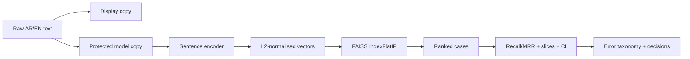

# اليوم الثالث — العربية، البحث، والحقيقة
# Day 3 — Arabic, Search, and Truth

**إعداد وتقديم | Prepared and delivered by:** ميعاد المري · Meaad Al-Marri  
**الوقت:** 08:30–13:30 · **البيئة:** Google Colab Free + GitHub

> **السؤال المحوري:** كيف نبني بحثًا دلاليًا عربيًا/إنجليزيًا، ثم نثبت بصدق أين ينجح وأين يضعف؟
>
> **Driving question:** How do we build bilingual semantic search and produce evidence that shows both strengths and weaknesses?

## قبل البدء | Entry gate

يجب أن تكون [بوابة اليوم الثاني Gate B](../day-02/05-labs-checkpoint.md) مكتملة:

- معالجة النص موثقة ولا تحتوي بيانات حقيقية.
- تقسيم البيانات بلا تداخل `group_id`.
- مسارات classification وNER وQA تعمل.
- نتائج العينة موسومة `MEASURED_SMOKE`.
- التقدم محفوظ في مستودع GitHub العام للمتدرب.

إذا لم تكتمل، استخدم نقطة الاستعادة في Gate B ولا تبدأ تنزيل نموذج بحث جديد قبل حفظ اليوم الثاني.

## نواتج اليوم | Outcomes

بنهاية اليوم تستطيع:

1. تفسير أثر الصرف واللواصق والتنوع الإملائي واللهجات وArabizi على NLP العربية.
2. إنشاء نسخة عرض محفوظة ونسخة نموذج مطبّعة باستخدام CAMeL Tools وعقد واضح.
3. تمييز sentence embedding عن token embedding وعن مخرجات مصنف اليوم الثاني.
4. بناء فهرس `FAISS IndexFlatIP` بعد L2 normalisation على جانبي البحث.
5. تنفيذ بحث دلالي ثنائي اللغة بمشفّر جمل متعدد اللغات.
6. قياس `Recall@k` و`MRR@k` وضبط no-answer threshold على validation فقط.
7. إنشاء sliced evaluation مع bootstrap confidence intervals.
8. تحويل الأخطاء إلى taxonomy وإصلاحات مرتبة وتقرير مشروع.
9. إكمال Gate C وربط الأدلة في GitHub.

## جدول اليوم | Schedule

| الوقت | الجلسة | الناتج المرئي |
|---|---|---|
| 08:30–09:20 | [العربية وCAMeL Tools](01-arabic-nlp-camel-tools.md) | profile + two-copy contract |
| 09:20–09:30 | استراحة | حفظ أول نقطة تقدم |
| 09:30–10:20 | [مختبر العربية](../notebooks/05_arabic_nlp.ipynb) | golden tests + variant audit |
| 10:20–10:30 | استراحة | إبقاء runtime مفتوحًا |
| 10:30–11:20 | [البحث الدلالي](02-semantic-search.md) | embedding → FAISS → ranking |
| 11:20–11:30 | استراحة | حفظ manifest وmetrics |
| 11:30–12:20 | [مختبر البحث](../notebooks/06_semantic_search.ipynb) | bilingual search + Recall/MRR |
| 12:20–12:40 | استراحة طويلة/صلاة | حفظ Drive وتحرير الذاكرة إن لزم |
| 12:40–13:05 | [التقييم وتحليل الأخطاء](03-evaluation-error-analysis.md) + [دفتر 07](../notebooks/07_evaluation_error_analysis.ipynb) | slices + CI + taxonomy |
| 13:05–13:30 | [Gate C](04-labs-checkpoint.md) | تقارير + commits + exit ticket |

إجمالي التعلم 250 دقيقة والاستراحات 50 دقيقة. إذا تأخر تنزيل النموذج، يستمر الصف في Notebook 07 لأنه لا يحتاج checkpoint جديدًا.

## خط بيان اليوم | Today’s Bayan pipeline

## لماذا لا نعيد Fine-tuning كاملًا؟

اليوم الثاني حقق هدف الضبط الدقيق فعليًا. في اليوم الثالث نحافظ على وقت الحصة لما لم يُبن بعد: العربية المتخصصة، البحث، والتقييم الصادق. المسار الأساسي يقارن العربية بعقد تطبيع وشرائح، ويستخدم sentence-transformer جاهزًا ومخصصًا للتضمينات. مقارنة checkpoints عربية إضافية أو إعادة الضبط الدقيق متاحة في Explore فقط، ولا تعوض نقص البحث أو التقييم.

## مسارات المستوى | Learning lanes

- 🟢 **Core:** CAMeL Tools utilities + multilingual sentence encoder + exact FAISS + metrics + slices. إلزامي ويعمل على CPU.
- 🔵 **Explore:** تشغيل dialect identifier بعد تنزيل بياناته، أو cross-encoder re-ranking على عدد صغير من المرشحين.
- 🟣 **Distinction:** مقارنة Flat مع HNSW، أو Arabizi lane، أو paired bootstrap لمقارنة إصدارين فعليين.

## الموارد والتكلفة | Cost

المسار الإلزامي مجاني ولا يحتاج API key:

- Google Colab Free؛ لا يشترط GPU.
- CAMeL Tools مفتوحة المصدر بترخيص MIT.
- Sentence Transformers والنموذج المختار بترخيص Apache-2.0.
- FAISS CPU مفتوح المصدر.
- GitHub Public للتسليم.

`Colab Pro` وخدمات الاستضافة أو قواعد المتجهات المدفوعة خيارات تشغيلية فقط؛ لا تمنح نقاطًا ولا يحتاجها المشروع.

## قاعدة الصدق العلمي | Evidence rule

بيانات اليوم الثالث اصطناعية وصغيرة. لذلك:

- نتائج البحث والتقييم تسمى `MEASURED_SMOKE`.
- بيانات التنبؤات الجاهزة تسمى `COURSE_FIXTURE`، وليست ناتج نموذج خفي.
- لا توجد قيمة نجاح ثابتة منسوخة في المشروع.
- كل threshold يضبط على validation، ثم يثبت قبل test.
- كل slice صغيرة تظهر بعلامة `SMALL_SLICE` بدل إخفائها.
- CI تعكس عدم اليقين في العينة، ولا تجعل العينة الصغيرة إنتاجية.

## مخرج بيان في نهاية اليوم

عند Gate C يملك كل متدرب:

- profile عربي versioned وموثق.
- فهرس بحث بمظهر manifest قابل للمراجعة.
- نتائج bilingual وcross-lingual موثقة.
- Recall@k وMRR@k وقرار no-answer.
- sliced report مع CIs وتحذيرات العينات الصغيرة.
- error taxonomy وثلاثة إصلاحات مرتبة.
- `EVALUATION_REPORT.md` وقرار بحث مضاف إلى `DECISIONS.md`.
- ثلاثة commits عامة تربط Labs 4–6.

## English recap

Day 3 turns Bayan into an evidence-backed bilingual retrieval system. The required path preserves raw text, applies a pinned Arabic profile to a protected model copy, embeds cases with a multilingual Sentence Transformer, indexes unit vectors with FAISS, measures retrieval with Recall@k and MRR, and reports uncertainty and sliced failures. Optional re-ranking and dialect identification begin only after Core is complete.
