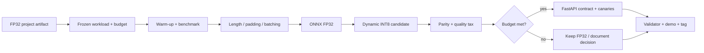

# اليوم الرابع — قِس، حسّن، اختبر، وسلّم
# Day 4 — Measure, Optimise, Test, and Ship

**إعداد وتقديم | Prepared and delivered by:** ميعاد المري · Meaad Al-Marri  
**الوقت:** 08:30–13:30 · **البيئة:** Google Colab Free + GitHub

> **السؤال المحوري:** كيف نحوّل نموذجًا يعمل في notebook إلى مسار استدلال مقاس، وخدمة مختبرة، ومشروع يستطيع مراجع جديد إعادة تشغيله؟
>
> **Driving question:** How do we turn a working notebook into measured inference, a tested service, and a reproducible submission?

## قبل البدء | Entry gate

يجب أن تكون [بوابة اليوم الثالث Gate C](../day-03/04-labs-checkpoint.md) مكتملة:

- معالجة العربية والبحث الدلالي يعملان على بيانات بيان الاصطناعية.
- Recall/MRR وtask metrics موثقة بالوسم الصحيح.
- `EVALUATION_REPORT.md` و`MODEL_CARD.md` يحتويان نتائج وحدودًا فعلية.
- error analysis أُجري على validation لا frozen test.
- تقدم الأيام الثلاثة محفوظ في مستودع GitHub العام.

إذا لم تكتمل، استخدم نقطة الاستعادة في Gate C. لا تجعل التكميم يخفي نقصًا في صحة المهمة.

## نواتج اليوم | Outcomes

بنهاية اليوم تستطيع:

1. تعريف latency وp50/p95/p99 وthroughput وRSS observed peak دون خلط بينها.
2. كتابة performance budget **قبل** تجربة البدائل.
3. تنفيذ benchmark منضبط له warm-up و30 تكرارًا على الأقل وبيئة موثقة.
4. تقليل الحشو باستخدام measured length وdynamic padding وbatching مناسب.
5. تصدير نموذج Transformer إلى ONNX والتحقق من numerical/prediction parity.
6. تجربة dynamic INT8 وقياس السرعة والحجم وquality tax بدل افتراض التحسن.
7. بناء عقد FastAPI واختباره داخل Colab عبر `TestClient` وحالات canary.
8. تمييز `SYSTEMS_SMOKE` عن قياس `PROJECT_ARTIFACT` النهائي.
9. اجتياز Gate D ثم فاحص Gate E وإنشاء tag التسليم.
10. عرض مشروع بيان وشرح رقم واحد موثوق وخطأ واحد معروف.

## جدول اليوم | Schedule

| الوقت | الجلسة | الناتج المرئي |
|---|---|---|
| 08:30–08:45 | [الاختبار القصير](../assessments/quiz/README.md) | 10 إجابات فردية مغلقة المراجع |
| 08:45–09:20 | [تحسين الاستدلال والخدمة](01-benchmark-before-optimization.md) + عرض النتائج المحفوظة | budget + measurement contract + ladder |
| 09:20–09:30 | استراحة | حفظ البيئة والميزانية |
| 09:30–09:50 | Lab 7: [Notebook 08](../notebooks/08_optimization_serving.ipynb) و[ONNX/INT8](02-onnx-int8-decision.md) | benchmark + parity + TestClient + Gate D evidence |
| 09:50–10:20 | [PA‑2](../assessments/pa-02/README.md) | مراجعة تقرير منافس وقرار شحن |
| 10:20–10:30 | استراحة | حفظ baseline قبل أي تغيير |
| 10:30–11:20 | [تجميع بيان I](04-capstone-assembly-demo.md) | classifier + NER/QA + search + evaluation evidence map |
| 11:20–11:30 | استراحة | الاحتفاظ بنسخة FP32 للرجوع |
| 11:30–12:20 | [تجميع بيان II + المراجعة النظيرة](04-capstone-assembly-demo.md) | cold-clone review + canaries + إغلاق Gate D/E |
| 12:20–12:40 | استراحة طويلة/صلاة | حفظ التقارير وإغلاق artefacts الكبيرة |
| 12:40–13:30 | [عروض بيان والتقييم والختام](05-lab-gates-submission.md) | 5 دقائق لكل زوج، سؤال دليل إلزامي، rubric مباشر |

إجمالي التعلم/التقييم 250 دقيقة والاستراحات 50 دقيقة، مطابق لخطة اليوم الرابع الرسمية ذات 30% شرح و70% تطبيق. عند السعة القصوى (20 متدربًا) يعمل المشاركون في 10 أزواج؛ العرض **5 دقائق إجمالًا لكل زوج** (4 دقائق demo + دقيقة سؤال الدليل). يبقى مستودع ودليل كل متدرب قابلين للتقييم الفردي، ويجب أن يجيب كل مشارك عن سؤال تحقق واحد أثناء العرض أو spot-check معلن.

صفحات [ONNX وINT8](02-onnx-int8-decision.md) و[FastAPI وcanaries](03-fastapi-serving-canaries.md) مرجعان قبل الحصة وأثناء المشروع. خلال العرض تستخدم المدربة النتائج المحفوظة بدل انتظار تنزيل/تصدير حي، ثم يقيس الطالب `PROJECT_ARTIFACT` في نسخته لإغلاق Gate D.

## خط بيان اليوم | Today’s Bayan delivery path

## سياقان لا يجوز خلطهما

| السياق | لماذا يوجد؟ | ما الذي يجوز ادعاؤه؟ | هل يكفي للتسليم النهائي؟ |
|---|---|---|---|
| `SYSTEMS_SMOKE` | تعلّم export وORT وAPI بسرعة على checkpoint صغير | أن المسار التقني يعمل وأن الإصدارين متقاربان عدديًا | لا |
| `PROJECT_ARTIFACT` | قياس نموذج بيان الفعلي وبياناته وعقد معالجته | أداء مشروعك ضمن البيئة والعمل والميزانية الموثقة | نعم، مع بقية الأدلة |

دفتر 08 يبدأ بمسار Systems Smoke مقاوم للتأخير، ثم يوضح موضع تبديل المصدر إلى artefact المشروع. فاحص التسليم النهائي يرفض `benchmark_mode: SYSTEMS_SMOKE`.

## سُلّم القرار | Optimisation ladder

غيّر عاملًا واحدًا ثم أعد القياس على workload نفسه:

1. inference mode وإزالة حساب gradients.
2. قياس الطول واختيار `max_length` مدعوم بالبيانات.
3. dynamic padding ثم length bucketing عند batching.
4. ONNX Runtime على الجهاز المستهدف.
5. dynamic INT8 إذا قبلت الجودة والعتاد النتيجة.
6. نموذج أصغر/مقطّر إذا بقيت الميزانية غير محققة.
7. عتاد أو استضافة مختلفة فقط بعد توثيق ما سبق.

لا يوجد ضمان أن ONNX أو INT8 أسرع على كل جهاز أو batch. النتيجة المقاسة هي التي تحكم.

## مسارات المستوى | Learning lanes

- 🟢 **Core:** Systems Smoke + benchmark صحيح + ONNX + INT8 candidate + TestClient + validator pre-tag.
- 🔵 **Explore:** bucketed batching أو مقارنة batch sizes أو Optimum ONNX مع workload نفسه.
- 🟣 **Distinction:** benchmark متزامن مضبوط، أو مقارنة نموذج distilled، أو drift/startup canary إضافي.

لا تعوّض إضافة متقدمة غياب benchmark المشروع أو التقارير أو tag.

## الموارد والتكلفة | Cost

المسار الإلزامي مجاني ولا يحتاج API key أو استضافة عامة:

- Google Colab Free؛ CPU يكفي لمسار Core، وGPU غير مضمون ولا يشترط.
- PyTorch وTransformers وONNX وONNX Runtime مفتوحة المصدر.
- FastAPI وHTTPX2/TestClient مفتوحة المصدر.
- GitHub Public للتاريخ والتسليم.

الاستضافة الدائمة وColab المدفوع وmanaged endpoints خيارات تشغيلية لاحقة، وليست جزءًا من الاجتياز.

## مخرج بيان في نهاية اليوم

عند Gate E يملك كل متدرب:

- benchmark قبل/بعد ببيئة وworkload ثابتين.
- p50/p95/p99 وthroughput وRSS observed peak وحجم artefact.
- parity check وquality tax وقرار نشر/تراجع معلل.
- خدمة FastAPI مختبرة بطلب عربي وإنجليزي وطلب مرفوض.
- canaries تمنع model/preprocessing skew.
- `BENCHMARKS.md` و`DECISIONS.md` و`PROGRESS.md` مكتملة.
- `PROJECT_SUMMARY.json` و`SUBMISSION.yml` صالحان.
- امتداد مشروع واحد مقاس ومربوط بدليل داخل `PROJECT_SUMMARY.json`.
- فاحص محلي ناجح، مستودع عام، وعلامة `submission-v1.0`.
- عرض موجز يربط كل claim بدليل.

## English recap

Day 4 turns Bayan into a measured, testable delivery artefact. Learners freeze a workload and budget, benchmark with warm-up and tail percentiles, test length/padding/batching, export to ONNX, evaluate a dynamic INT8 candidate, quantify quality tax, test a FastAPI contract with canaries, and validate the final public repository. A systems smoke proves mechanics; only a project-artifact benchmark supports the final submission.
