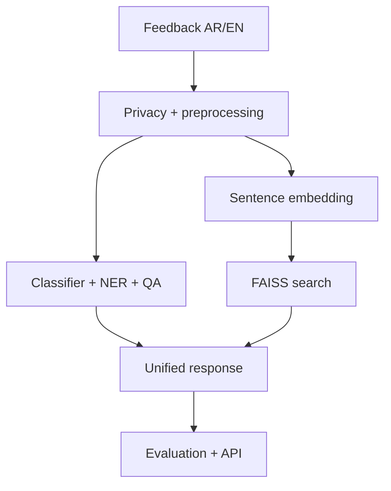

# مشروع بيان | Bayan Capstone Specification

## الفكرة | Purpose

**بيان** نظام تعليمي ثنائي اللغة يساعد فريق خدمة عامة على فهم ملاحظات المستفيدين بالعربية والإنجليزية. المطلوب ليس منتجًا حكوميًا حقيقيًا، بل مشروعًا آمنًا وقابلًا للقياس يثبت نواتج التعلم السبعة.

**Bayan** is a bilingual educational system for analysing Arabic and English citizen feedback. It is not a production government service; it is a safe, measurable capstone demonstrating all seven learning outcomes.

## قصة المستخدم | User story

عند وصول ملاحظة، ينفذ النظام:

1. يحفظ نسخة عرض غير معدلة ويُخفي PII في نسخة المعالجة.
2. يحدد اللغة ويطبق profile معالجة مناسبًا.
3. يصنف الموضوع والمشاعر بعقدي labels منفصلين.
4. يستخرج الكيانات المسماة.
5. يجيب عن سؤال استخراجي عندما يتوفر سياق، مع دعم no-answer.
6. يسترجع حالات سابقة مشابهة دلاليًا.
7. يعيد JSON موثقًا مع زمن الاستجابة ومعرّفات النماذج.

## المعمارية الإلزامية | Required architecture

## نطاق الحد الأدنى | Minimum viable scope

| المكوّن | المطلوب |
|---|---|
| المعالجة | وحدة واحدة versioned تُستخدم في التدريب والتقييم والخدمة، مع masking واختبارات ذهبية |
| التصنيف | baseline كلاسيكي + Transformer أو checkpoint صغير مضبوط، مع macro-F1 |
| NER | محاذاة labels صحيحة وتقييم entity-level باستخدام precision/recall/F1 |
| QA | extractive pipeline مع منطق null/no-answer واختبارات حدية |
| البحث | sentence embeddings مطبعة + FAISS `IndexFlatIP` + cross-encoder على المرشحين + Recall@k وMRR والزمن قبل/بعد |
| العربية | profile موثق متوافق مع checkpoint؛ CAMeL Tools في موضع له فائدة |
| التقييم | slices حسب اللغة والفئة/الطول، interval أو تكرار بذور حيث يناسب، وتحليل أخطاء |
| التحسين | baseline وoptimized benchmark مع latency وmemory وquality tax |
| الخدمة | FastAPI أو دوال خدمة موحدة، واختبار داخل Colab عبر `TestClient` |
| التوثيق | README، قرارات، benchmark، report، model card، data card، limitations |

## أهداف المشروع الرقمية الرسمية | Official capstone targets

الأرقام التالية هي `TARGET` من حزمة البرنامج المرجعية، وليست نتائج الدفاتر المصغرة ولا أرقامًا ينسخها المتدرب:

| المتطلب | بوابة القبول الرسمية |
|---|---|
| R1 — المعالجة | وحدة versioned واحدة في التدريب والتقييم والخدمة؛ PII masking recall=`100%` على canaries المقررة؛ skew canaries عند startup |
| R2 — النماذج | classifier أعلى من TF‑IDF بـ`≥8` نقاط Macro‑F1؛ NER entity‑F1 `≥0.80`؛ QA no-answer `≥17/20`؛ وأي ادعاء تفوق على Gulf slice مدعوم بـCI |
| R3 — البحث | retrieve ثم cross-encoder re-rank؛ Recall@10 `≥0.80` وMRR@10 `≥0.70`؛ وفرق cross-lingual موثق |
| R4 — التقييم | invariance `≥95%` وminimum-functionality `≥90%` على suite المقررة؛ قراءة يدوية لـ`≥100` خطأ وبناء top‑3 fixes |
| R5 — الخدمة | classifier p99 عبر HTTP `≤40 ms` على جهاز المختبر المرجعي وبـ`16` طلبًا متزامنًا؛ ladder كاملة وFP32 rollback |
| R6 — الثقافة المعمارية | `DECISIONS.md` يربط اختيار كل عائلة/checkpoint بـfertility وslice evidence وحدود attention/architecture |
| R7 — النظافة والامتداد | frozen test لا يُفتح قبل التقرير؛ تشغيل قابل للإعادة؛ `BENCHMARKS.md` من قياسات الطالب؛ وامتداد واحد مقاس من القائمة أدناه |

هذه الأهداف لا تصبح قابلة للتصحيح إلا على **حزمة الدفعة المعلنة**: corpus/splits وquery/no-answer/behavioural sets المجمدة، مواصفة جهاز المختبر، وحمل التزامن. أما بيانات هذا المستودع الصغيرة فتبقى `MEASURED_SMOKE` لتدقيق المنهج والكود، ولا يجوز استخدامها لإعلان اجتياز R1–R7. يجب أن تعلن الجهة المنظمة حزمة الدفعة وhashes وبيئة القياس قبل التقييم؛ ولا تُغيّر البوابات بعد رؤية نتائج المشاركين.

## حدود البيانات | Data boundaries

- تستخدم مجموعة بيان الاصطناعية الموزعة مع الدورة أو بيانات عامة ذات ترخيص واضح.
- لا تُدخل بيانات مواطنين حقيقية.
- تنقسم البيانات قبل أي tuning إلى train/validation/frozen test، مع grouping لمنع تسرب نصوص الشخص/الحالة.
- لا يُقرأ frozen test للتحليل أو التحسين؛ يستخدم مرة في التقرير النهائي.
- تسجل البذرة، نسب الانقسام، hash/نسخة البيانات، وأي filtering.

## مراحل المشروع | Daily milestones

| البوابة | الموعد | شرط العبور |
|---|---|---|
| A — ingest | نهاية اليوم 1 | golden preprocessing tests خضراء + قرار tokenizer |
| B — tasks | نهاية اليوم 2 | baseline موثق + مسارات classification/NER/QA تعمل |
| C — search & truth | نهاية اليوم 3 | search metrics + sliced evaluation + taxonomy |
| D — ship | [اليوم 4، الجلسة 4](../day-04/05-lab-gates-submission.md) | API tests + benchmark قبل/بعد + canaries على `PROJECT_ARTIFACT` |
| E — submit | [اليوم 4، الجلسة 5](../day-04/05-lab-gates-submission.md) | validator + demo + tag `submission-v1.0` |

## ملفات التسليم | Deliverables

- `README.md`: المشكلة، التشغيل على Colab، النتائج، الحدود.
- `STUDENT_PROFILE.md`: الاسم المخصص للتقييم دون بيانات حساسة.
- `PROGRESS.md`: بوابات A–E.
- `DECISIONS.md`: كل قرار مع البدائل والدليل.
- `BENCHMARKS.md`: بيئة القياس، warm-up، repetitions، p50/p95/p99، memory، quality.
- `EVALUATION_REPORT.md`: metrics، slices، uncertainty، errors، fixes.
- `MODEL_CARD.md` (قسم كامل لكل artefact أو بطاقات منفصلة مرتبطة منه) و`DATA_CARD.md`.
- `PROJECT_SUMMARY.json` و`SUBMISSION.yml` بصيغ قابلة للفحص.
- 9 notebooks المطلوبة، و`src/bayan`، و`tests`، ومخرجات عيّنة صغيرة.
- رابط Colab لكل notebook ولقطة badge الاختبارات في README.

استخدم [قوالب المشروع](../templates/) وفاحص [`scripts/validate_submission.py`](../scripts/validate_submission.py). لا يُقبل `SYSTEMS_SMOKE` بوصفه benchmark نهائيًا؛ يجب أن يصرح `PROJECT_SUMMARY.json` بـ`PROJECT_ARTIFACT` بعد القياس الفعلي.

## ميزانية الأداء | Performance budget

الأهداف الرقمية النهائية لا تُنسخ من مرجع؛ تُقاس على بيئة المتدرب وتوسم `MEASURED`. يحدد المتدرب budget واقعيًا قبل التحسين، ثم يبرر هل تحقق أم لا. يجب عرض:

- device وruntime ونسخ المكتبات؛
- dataset/model/batch/sequence length؛
- warm-up منفصل و30 تكرارًا على الأقل حين يسمح الوقت؛
- p50 وp95 وp99، throughput، وpeak memory التقريبية؛
- الفرق في جودة المهمة بين baseline وoptimized.

## العرض | Demo

**5 دقائق إجمالًا لكل زوج** عند السعة القصوى، مع بقاء أدلة كل مشارك قابلة للتقييم الفردي:

1. 20 ثانية: المشكلة والحدود.
2. 80 ثانية: مثال عربي وآخر إنجليزي.
3. 50 ثانية: البحث الدلالي.
4. 50 ثانية: رقم تقييم ورقم أداء مع مصدرهما.
5. 40 ثانية: خطأ معروف وقرار هندسي.
6. 60 ثانية: سؤال التحقق الإلزامي: **لماذا نثق بهذا الرقم؟ | Why should we trust this number?**

عند وجود 20 متدربًا يكون ترتيب العرض لـ10 أزواج متتابعة، وتكون المشاريع مفتوحة مسبقًا لتجنب وقت تبديل الأجهزة. يجيب كل مشارك عن سؤال تحقق واحد أثناء العرض أو spot-check معلن.

## امتداد المشروع الإلزامي | Required measured extension

اختر واحدة بعد اكتمال R1–R7: dialect router، encoder برأسين، تحسين جودة البحث، batch endpoint، أو QA على مستندات طويلة. يجب قياس الفائدة والتكلفة وذكر baseline؛ وجود feature بلا تقييم لا يحقق المتطلب.

**مهام bonus للمنتهين مبكرًا:** zero-shot showdown، Arabizi lane، drift tripwire، أو مقارنة HNSW/IVF مع Flat على corpus موسع. يطبق bonus الرسمي حتى `+5` نقاط فقط إذا بلغت المتطلبات الإلزامية `80/100` على الأقل، ولا تتجاوز الدرجة `100`.

## تعريف الإنجاز | Definition of done

المشروع منجز عندما يمكن لمراجع جديد فتح README، تشغيل مسار smoke على Colab Free أو CPU، مشاهدة الاختبارات، تتبع كل رقم إلى artefact، وفهم القيود دون شرح شفهي من صاحبه.
