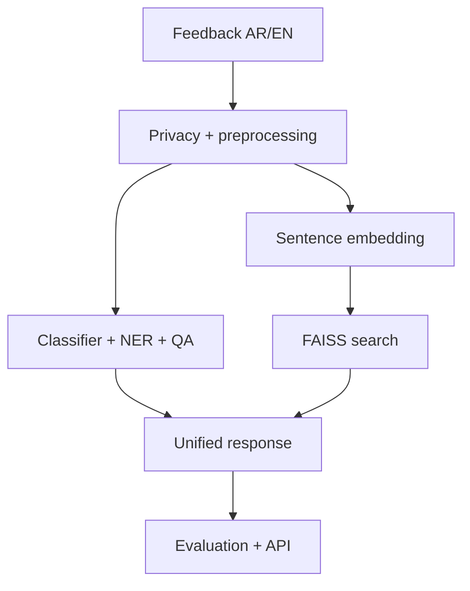

# مشروع بيان | Bayan Capstone Specification

## الفكرة | Purpose

**بيان** نظام تعليمي ثنائي اللغة يساعد فريق خدمة عامة على فهم ملاحظات المستفيدين بالعربية والإنجليزية. المطلوب ليس منتجًا حكوميًا حقيقيًا، بل مشروعًا آمنًا وقابلًا للقياس يثبت نواتج التعلم السبعة.

**Bayan** is a bilingual educational system for analysing Arabic and English citizen feedback. It is not a production government service; it is a safe, measurable capstone demonstrating all seven learning outcomes.

## قصة المستخدم | User story

عند وصول ملاحظة، ينفذ النظام:

1. يحفظ نسخة عرض غير معدلة ويُخفي PII في نسخة المعالجة.
2. يحدد اللغة ويطبق profile معالجة مناسبًا.
3. يصنف الموضوع/الأولوية أو المشاعر.
4. يستخرج الكيانات المسماة.
5. يجيب عن سؤال استخراجي عندما يتوفر سياق، مع دعم no-answer.
6. يسترجع حالات سابقة مشابهة دلاليًا.
7. يعيد JSON موثقًا مع زمن الاستجابة ومعرّفات النماذج.

## المعمارية الإلزامية | Required architecture

## نطاق الحد الأدنى | Minimum viable scope

| المكوّن | المطلوب |
|---|---|
| المعالجة | وحدة واحدة versioned تُستخدم في التدريب والتقييم والخدمة، مع masking واختبارات ذهبية |
| التصنيف | baseline كلاسيكي + Transformer أو checkpoint صغير مضبوط، مع macro-F1 |
| NER | محاذاة labels صحيحة وتقييم entity-level باستخدام precision/recall/F1 |
| QA | extractive pipeline مع منطق null/no-answer واختبارات حدية |
| البحث | sentence embeddings مطبعة + FAISS `IndexFlatIP` + Recall@k وMRR |
| العربية | profile موثق متوافق مع checkpoint؛ CAMeL Tools في موضع له فائدة |
| التقييم | slices حسب اللغة والفئة/الطول، interval أو تكرار بذور حيث يناسب، وتحليل أخطاء |
| التحسين | baseline وoptimized benchmark مع latency وmemory وquality tax |
| الخدمة | FastAPI أو دوال خدمة موحدة، واختبار داخل Colab عبر `TestClient` |
| التوثيق | README، قرارات، benchmark، report، model card، data card، limitations |

## حدود البيانات | Data boundaries

- تستخدم مجموعة بيان الاصطناعية الموزعة مع الدورة أو بيانات عامة ذات ترخيص واضح.
- لا تُدخل بيانات مواطنين حقيقية.
- تنقسم البيانات قبل أي tuning إلى train/validation/frozen test، مع grouping لمنع تسرب نصوص الشخص/الحالة.
- لا يُقرأ frozen test للتحليل أو التحسين؛ يستخدم مرة في التقرير النهائي.
- تسجل البذرة، نسب الانقسام، hash/نسخة البيانات، وأي filtering.

## مراحل المشروع | Daily milestones

| البوابة | الموعد | شرط العبور |
|---|---|---|
| A — ingest | نهاية اليوم 1 | golden preprocessing tests خضراء + قرار tokenizer |
| B — tasks | نهاية اليوم 2 | baseline موثق + مسارات classification/NER/QA تعمل |
| C — search & truth | نهاية اليوم 3 | search metrics + sliced evaluation + taxonomy |
| D — ship | اليوم 4، الجلسة 4 | API tests + benchmark قبل/بعد + canaries |
| E — submit | اليوم 4، الجلسة 5 | validator + demo + tag `submission-v1.0` |

## ملفات التسليم | Deliverables

- `README.md`: المشكلة، التشغيل على Colab، النتائج، الحدود.
- `STUDENT_PROFILE.md`: الاسم المخصص للتقييم دون بيانات حساسة.
- `PROGRESS.md`: بوابات A–E.
- `DECISIONS.md`: كل قرار مع البدائل والدليل.
- `BENCHMARKS.md`: بيئة القياس، warm-up، repetitions، p50/p95/p99، memory، quality.
- `EVALUATION_REPORT.md`: metrics، slices، uncertainty، errors، fixes.
- `MODEL_CARD.md` و`DATA_CARD.md`.
- `PROJECT_SUMMARY.json` و`SUBMISSION.yml` بصيغ قابلة للفحص.
- 9 notebooks المطلوبة، و`src/bayan`، و`tests`، ومخرجات عيّنة صغيرة.
- رابط Colab لكل notebook ولقطة badge الاختبارات في README.

## ميزانية الأداء | Performance budget

الأهداف الرقمية النهائية لا تُنسخ من مرجع؛ تُقاس على بيئة المتدرب وتوسم `MEASURED`. يحدد المتدرب budget واقعيًا قبل التحسين، ثم يبرر هل تحقق أم لا. يجب عرض:

- device وruntime ونسخ المكتبات؛
- dataset/model/batch/sequence length؛
- warm-up منفصل و30 تكرارًا على الأقل حين يسمح الوقت؛
- p50 وp95 وp99، throughput، وpeak memory التقريبية؛
- الفرق في جودة المهمة بين baseline وoptimized.

## العرض | Demo

**5 دقائق + دقيقتان للأسئلة** لكل مشروع أو وفق تنظيم العدد:

1. 30 ثانية: المشكلة والحدود.
2. 90 ثانية: مثال عربي وآخر إنجليزي.
3. 60 ثانية: البحث الدلالي.
4. 60 ثانية: رقم تقييم ورقم أداء مع مصدرهما.
5. 60 ثانية: خطأ معروف وقرار هندسي.
6. سؤال المدربة الإلزامي: **لماذا نثق بهذا الرقم؟ | Why should we trust this number?**

عند وجود 20 متدربًا تُستخدم عروض ثنائية/مجموعات مراجعة متوازية، بينما يبقى مستودع ودليل كل متدرب فرديًا.

## إضافات التميّز | Distinction extensions

اختر واحدة فقط بعد اكتمال الحد الأدنى: Arabizi lane، re-ranking بـ cross-encoder، drift simulation، مقارنة HNSW/IVF مع Flat، أو واجهة بسيطة. يجب قياس فائدتها وتكلفتها؛ وجود feature بلا تقييم لا يمنح نقاطًا.

## تعريف الإنجاز | Definition of done

المشروع منجز عندما يمكن لمراجع جديد فتح README، تشغيل مسار smoke على Colab Free أو CPU، مشاهدة الاختبارات، تتبع كل رقم إلى artefact، وفهم القيود دون شرح شفهي من صاحبه.
