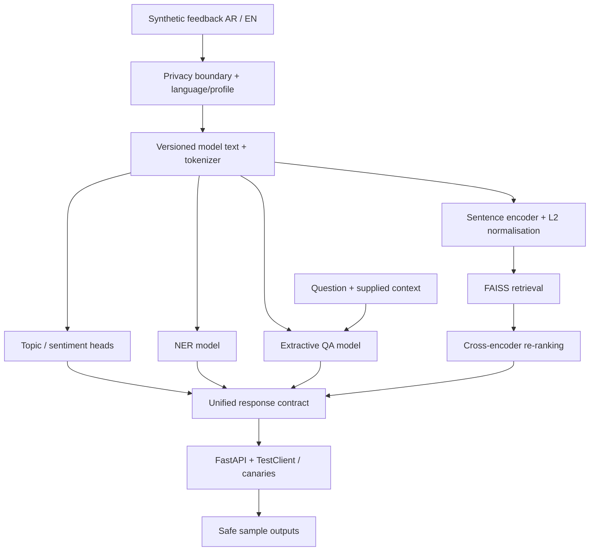

# بيان: السيناريو والمعمارية | Bayan scenario and architecture

| English | العربية |
|---|---|
| **Scenario:** a fictional public-service support team receives Arabic and English feedback. Employees need to group messages, understand sentiment, locate entities, find similar historical cases and answer questions only from supplied service text. | **السيناريو:** يستقبل فريق دعم لخدمات عامة افتراضية ملاحظات بالعربية والإنجليزية. يحتاج الموظف إلى تصنيفها وفهم مشاعر أصحابها وتحديد الكيانات واسترجاع حالات سابقة والإجابة من نصوص الخدمة المتاحة فقط. |
| **Your role:** build and evaluate the bilingual analysis components through the existing labs. Each day contributes to the same final Bayan project; there is no second project to start at the end. | **دورك:** بناء مكونات التحليل الثنائي وتقييمها عبر اللابات الحالية. يضيف كل يوم جزءًا إلى مشروع بيان النهائي نفسه؛ لا يوجد مشروع ثانٍ تبدأه في النهاية. |
| **Boundary:** all examples are synthetic. Bayan is not an official government system, a generative chatbot or an autonomous decision maker. Classification supports human review; it does not decide service entitlement. | **الحدود:** الأمثلة اصطناعية. بيان ليس نظامًا حكوميًا رسميًا ولا روبوت محادثة توليديًا ولا صاحب قرار مستقل. التصنيف يدعم المراجعة البشرية ولا يقرر استحقاق الخدمة. |

<!-- BAYAN_YOUTUBE_START -->
### شاهد الفكرة ثم طبّقها | Video companions

<div class="card youtube-topic youtube-t24"><h3 class="pair"><span class="en" lang="en" dir="ltr">Connect the NLP pipeline</span><span class="ar" lang="ar" dir="rtl">ربط مسار معالجة اللغة</span></h3><div class="pair"><p class="en" lang="en" dir="ltr">Follow preprocessing, model inference and postprocessing; then connect Bayan’s branches.</p><p class="ar" lang="ar" dir="rtl">تتبع المعالجة والاستدلال وتجهيز المخرج ثم اربط فروع بيان.</p></div><p><strong lang="en" dir="ltr">What Happens Inside the Pipeline Function?</strong><br><span class="micro">Hugging Face · English audio / الصوت بالإنجليزية</span></p><p><a class="button primary" href="https://www.youtube.com/watch?v=1pedAIvTWXk" target="_blank" rel="noopener noreferrer">▶ Watch on YouTube · شاهد على YouTube ↗</a></p><div class="callout warning"><div class="pair"><p class="en" lang="en" dir="ltr">One pipeline building block, not the full Bayan architecture. Use the project diagram for the parallel task and search branches.</p><p class="ar" lang="ar" dir="rtl">لبنة واحدة لا معمارية بيان الكاملة. استخدم مخطط المشروع لفروع المهام والبحث.</p></div></div><details><summary>بعد المشاهدة: اربط الفكرة ببيان · Connect it to Bayan</summary><div class="pair"><p class="en" lang="en" dir="ltr">Which components are prepared offline and which run for each request?</p><p class="ar" lang="ar" dir="rtl">أي المكونات تُجهز مسبقًا وأيها يعمل لكل طلب؟</p></div><div class="pair"><p class="en" lang="en" dir="ltr">Self-check, not a graded task.</p><p class="ar" lang="ar" dir="rtl">سؤال للفهم الذاتي، وليس تكليفًا بدرجة.</p></div></details></div>

<!-- BAYAN_YOUTUBE_END -->

## مثال تتبعه من البداية للنهاية | Follow one example

| Stage | English | العربية |
|---|---|---|
| Input | “My permit renewal has been delayed in Riyadh. When will it be completed?” | «تأخر تجديد التصريح في الرياض. متى يكتمل؟» |
| Context | An explicitly synthetic context says: “Renewal takes five working days after all documents are received.” | سياق اصطناعي معلن: «يستغرق التجديد خمسة أيام عمل بعد اكتمال المستندات». |
| Protection | Mask identifiers if any; preserve a safe display copy and document the model-text transformation. | أخفِ المعرّفات إن وجدت؛ واحتفظ بنسخة عرض آمنة ووثّق تحويل نص النموذج. |
| Task outputs | Predict topic and sentiment using the dataset's actual labels; extract “Riyadh” if the entity schema includes locations. | توقع الموضوع والمشاعر باستخدام وسوم البيانات الفعلية؛ واستخرج «الرياض» إذا كان مخطط الكيانات يتضمن المواقع. |
| QA | Select the supported context span. Remove the timing sentence and check that no-answer works. | اختر المقطع الذي يسنده السياق. احذف جملة المدة وافحص سلوك عدم وجود إجابة. |
| Search | Retrieve similar synthetic cases, then re-rank the shortlist and retain case IDs. | استرجع حالات اصطناعية متشابهة، وأعد ترتيب المرشحين واحتفظ بمعرّفاتهم. |
| Evidence | Record your actual outputs and metrics. This walkthrough gives expected behaviour, **not measured predictions or fixed labels to copy**. | سجل مخرجاتك ومقاييسك الفعلية. يوضح المثال السلوك المتوقع، **لا تنبؤات مقاسة ولا وسومًا ثابتة للنسخ**. |

## معمارية الخدمة | Service architecture



| English | العربية |
|---|---|
| **Offline preparation:** freeze splits, prepare data, fit the baseline and task models, build the search index and record model/profile versions. | **التجهيز خارج الطلب:** تثبيت تقسيم البيانات وتجهيزها، وتدريب خط الأساس ونماذج المهام، وبناء فهرس البحث وتسجيل إصدارات النماذج والمعالجة. |
| **Inference:** use the saved components to analyse an input. Classification, NER/QA and retrieval are branches, not steps that must train one another on each request. QA requires a question and context. | **الاستدلال:** استخدام المكونات المحفوظة لتحليل المدخل. التصنيف والكيانات والأسئلة والبحث فروع، وليست سلسلة يعيد كل طلب تدريبها. تحتاج QA سؤالًا وسياقًا. |
| **Cross-cutting checks:** privacy, split integrity, evaluation, quality/latency comparisons and provenance apply across the pipeline. They are not a cosmetic final report. | **فحوص عابرة للمكونات:** الخصوصية وسلامة التقسيم والتقييم ومقارنة الجودة والزمن ومصدر النتائج تصاحب المسار كله، وليست تقريرًا شكليًا في النهاية. |
| **Deployment boundary:** a local tested service is sufficient for the teaching workflow. Keep checkpoints private and record reproducible model sources; do not upload weights to the public repository. | **حدود النشر:** تكفي خدمة محلية مختبرة لمسار التعلم. احفظ نقاط النماذج بصورة خاصة ووثّق مصادر إعادة الإنتاج؛ ولا ترفع الأوزان إلى المستودع العام. |

## هيكل مستودعك | Your repository structure

```text
bayan-nlp-YOUR_USERNAME/
├── README.md                 # problem, architecture, own Colab links, results, credits
├── STUDENT_PROFILE.md        # GitHub username or learner ID; no sensitive details
├── PROGRESS.md               # gates A–E and evidence links
├── DECISIONS.md              # alternatives, evidence and your measured extension
├── EVALUATION_REPORT.md      # task metrics, slices, errors and limitations
├── BENCHMARKS.md             # actual before/after project measurements
├── MODEL_CARD.md             # model/checkpoint versions and limits
├── DATA_CARD.md              # synthetic data, splits and licence/source
├── PRESENTATION.md           # five-part talk plan and demo/report links
├── PROJECT_SUMMARY.json      # machine-readable project facts
├── SUBMISSION.yml            # your repository identity and final tag
├── notebooks/               # unchanged required names 00 through 08
├── src/bayan/               # shared Python components
├── tests/                   # technical unit tests
├── reports/                 # small outputs + submission_validation.json + preflight.json
├── sample_outputs/          # safe Arabic and English examples
└── scripts/                 # validators and safe export helper
```

هذا هيكل **مستودع المتدرب**، لا هيكل موقع الدورة. لا ترفع `portal/` أو `docs/index.html` بدل كود مشروعك. استخدم حزمة البداية المخصصة للطالب، لا نسخة الموقع الكامل.

This is the **learner repository**, not the course website. Upload the student starter contents, not `portal/` or the compiled website as a substitute for your project.

[المواصفات العلمية الكاملة](03-capstone-spec.md) · [مصادر ومحتوى الأيام](01-outcomes-map.md) · [التقييم من 100](policies/assessment-and-completion.md)
