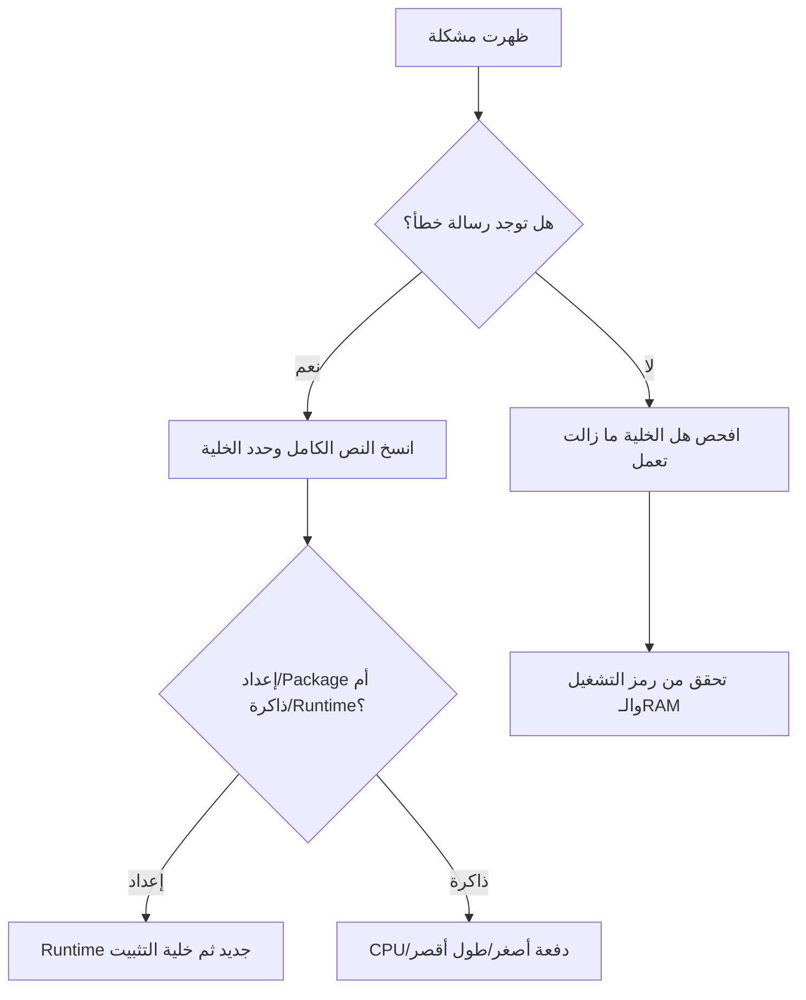

# استكشاف الأعطال | Troubleshooting

## القاعدة الذهبية

اقرأ **أول رسالة خطأ ذات معنى**، ثم غيّر شيئًا واحدًا فقط وأعد الاختبار. تكرار Run دون تشخيص لا يصلح الخطأ.

## مسار القرار



## مشاكل شائعة

### `ModuleNotFoundError`

**السبب المعتاد:** لم تُشغّل خلية التثبيت، أو أُعيد تشغيل runtime.

**نفذ:**

1. ارجع إلى خلية Setup.
2. شغّلها مرة واحدة.
3. إذا طلبت restart، أعد الجلسة.
4. شغّل من الأعلى.

لا تضف إصدارًا عشوائيًا من الإنترنت؛ استخدم إصدار notebook.

### `CUDA out of memory`

**ليست مشكلة في إجابتك بالضرورة.**

1. احفظ checkpoint.
2. خفّض `batch_size`.
3. خفّض `max_length`.
4. استخدم reduced dataset.
5. انتقل إلى CPU/tiny model إذا وجهتك الصفحة.

بعد OOM قد تبقى الذاكرة محجوزة؛ أعد runtime عند الحاجة.

### GPU غير متاح

هذا متوقع أحيانًا في Colab Free. لا تنتظر أكثر من تعليمات الجلسة. اختر CPU وشغّل المسار 🟢 المصغر. [Colab يوضح رسميًا](https://research.google.com/colaboratory/faq.html) أن أنواع الموارد وحدودها تتغير.

### انقطع runtime أو اختفت الملفات

- أعد الاتصال.
- شغّل Runtime Doctor.
- استعد آخر checkpoint من Drive.
- لا تتوقع بقاء `/content`.
- راجع آخر commit و`PROGRESS.md`.

### Drive لا يركب

- تأكد أنك سجلت دخول الحساب الصحيح.
- اقرأ نافذة الصلاحية وأكملها.
- اسمح بالنوافذ المنبثقة لموقع Colab عند الحاجة.
- جرّب runtime جديدًا مرة واحدة.
- لا تشغّل أكواد mount متكررة داخل loop.

### فشل Save a copy in GitHub

- تأكد أن GitHub مفتوح ومسجل في المتصفح نفسه.
- اسمح لنافذة OAuth الرسمية.
- تأكد أنك تملك المستودع وأنه ليس read-only.
- اختر مسارًا لا يستبدل ملفًا آخر بالخطأ.
- احفظ/download ملف `.ipynb` مؤقتًا ثم ارفعه من GitHub web إن تعذر التكامل.

### `FileNotFoundError`

اطبع المكان الحالي والملفات:

```python
from pathlib import Path
print("cwd:", Path.cwd())
print("files:", [p.name for p in Path.cwd().iterdir()][:30])
```

لا تكتب مسار Drive من الذاكرة؛ انسخه من Files بعد mount.

### العربية تظهر مفصولة أو باتجاه غريب

قد يكون العرض فقط، لا البيانات. افحص:

```python
text = "مرحبًا بكم في بيان"
print(repr(text))
print(text.encode("utf-8"))
assert text.encode("utf-8").decode("utf-8") == text
```

لا تقلب الأحرف يدويًا ولا تحفظ نصًا معكوسًا.

### الاختبار فشل رغم أن المخرج “يشبه” الصحيح

الاختبار قد يفحص مسافة، Unicode code point، type، shape، أو ترتيبًا. اطبع `repr(value)` و`type(value)` و`shape` إن وجدت. لا تعدّل الاختبار ليصبح أخضر.

## طلب المساعدة الصحيح

```text
Notebook:
Cell title:
Full error:
Expected:
Observed:
Runtime: CPU/GPU
One action already tried:
```

لا ترسل screenshot فقط إذا كان الخطأ قابلًا للنسخ. أخفِ البريد، أسماء الملفات الشخصية، tokens، ومسارات Drive الحساسة.

## متى أتوقف؟

توقف واطلب مساعدة إذا:

- ظهرت نافذة صلاحية غير متوقعة.
- طلب الكود password أو token داخل خلية عامة.
- وجدت بيانات شخصية حقيقية.
- تكرر الخطأ بعد runtime جديد والمسار المحدد.
- ستضطر إلى حذف/استبدال ملفات كثيرة ولا تعرف الهدف.
